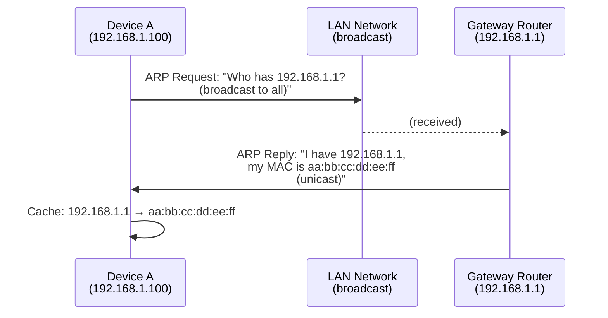
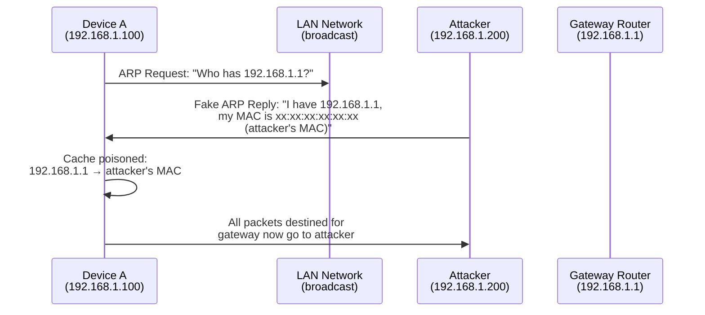

# ARP and MAC Addresses

> MAC addresses are your device's hardware identity on the local network, while ARP is the protocol that maps those addresses to IP addresses—and a common attack vector.

## What it is

Every network interface card (NIC)—whether Wi-Fi or Ethernet—has a **Media Access Control (MAC) address**, a 48-bit identifier burned into the hardware. It looks like `dc:a6:32:aa:bb:cc` and serves as the device's "postal address" on your physical network segment (your LAN).

**Address Resolution Protocol (ARP)** is the mechanism devices use to translate IP addresses (`192.168.1.100`) into MAC addresses. When Device A needs to send a packet to Device B on the same network, it asks via broadcast: "Who has IP `192.168.1.100`?" Device B (or a gateway) replies with its MAC address, and communication begins.

## Why it matters for your network

ARP is fundamental to LAN communication, but it has a critical weakness: **it trusts replies without verification**. This makes it the gateway to man-in-the-middle (MITM) attacks.

An attacker on your LAN can send fake ARP replies claiming "I am `192.168.1.1`" (your gateway) with their own MAC address. Devices update their ARP cache and start sending all traffic through the attacker instead. You remain connected, but all your traffic is intercepted and can be eavesdropped, modified, or redirected.

MAC addresses also leak device type and manufacturer information. The first 3 octets (the OUI—Organizationally Unique Identifier) identify the vendor: `dc:a6:32` is Raspberry Pi, `d4:6e:0e` is Apple. Attackers use this to target specific devices.

## How it works

### MAC Address Structure

A MAC address is 48 bits, typically written as six hexadecimal pairs separated by colons:

```
dc:a6:32:aa:bb:cc
├─ OUI (Organizationally Unique Identifier)
│  └─ identifies the manufacturer (Raspberry Pi Foundation)
└─ NIC-specific part (assigned by the vendor)
```

The first 3 octets (24 bits) are the OUI—globally unique identifiers assigned by IEEE. The remaining 3 octets are assigned by the manufacturer to individual devices. Unlike IP addresses, MAC addresses don't change and aren't assigned by your network admin; they're fixed in hardware.

### Normal ARP Exchange



Device A broadcasts an ARP request asking for the MAC of IP `192.168.1.1`. The gateway receives it and unicasts an ARP reply with its MAC. Device A caches this mapping and uses it to send packets to the gateway.

### ARP Spoofing Attack

An attacker on the LAN can inject a fake ARP reply before the legitimate gateway responds, or send unsolicited ARP announcements:



Devices accept the spoofed reply, update their ARP cache incorrectly, and send packets to the attacker instead of the legitimate gateway. The attacker can now intercept, modify, or drop traffic.

### ARP Table and Cache

Your system maintains an ARP table—a cache of recent IP-to-MAC mappings:

```bash
$ arp -a
? (192.168.1.1) at aa:bb:cc:dd:ee:ff on en0 ifscope [ethernet]
? (192.168.1.100) at dc:a6:32:11:22:33 on en0 ifscope [ethernet]
```

Each entry has a TTL (time-to-live); stale entries are eventually purged. Under normal conditions, the ARP table is stable. Sudden changes or duplicate MACs for the same IP indicate spoofing.

### Gratuitous ARP

A **gratuitous ARP** is an unsolicited announcement: "I have IP `192.168.1.100`, my MAC is `dc:a6:32:11:22:33`." Broadcast with no request.

Legitimate uses:
- **IP failover**: When a backup device takes over an IP, it sends gratuitous ARP to immediately update caches.
- **Duplicate detection**: A new device announces its IP to check if it's already in use.

Malicious uses:
- **Spoofing**: An attacker floods gratuitous ARP announcements claiming to own the gateway IP, poisoning every cache on the LAN.

## What netglance checks

### [`tools/arp.md`](../../reference/tools/arp.md)

The **ARP monitor** checks:

- **ARP table consistency**: Detects sudden changes, duplicate MACs for the same IP, and orphaned entries.
- **Spoof detection**: Compares observed MAC addresses against a baseline. If the gateway's MAC changes, flags it as potential spoofing.
- **Gratuitous ARP monitoring**: Tracks unsolicited ARP announcements and alerts on suspicious patterns (e.g., frequent gratuitous ARPs from non-gateway IPs).

### [`tools/discover.md`](../../reference/tools/discover.md)

The **device discovery** tool:

- **ARP scanning**: Sends ARP requests to all IPs in your subnet and collects responses to build a device inventory.
- **OUI vendor lookup**: Matches the first 3 octets of each discovered MAC against a database to identify device types (e.g., "Raspberry Pi", "Apple Inc.", "Cisco").
- **Device fingerprinting**: Combines vendor info with service discovery to classify devices (printer, IoT gateway, smartphone, etc.).

## Key terms

| Term | Definition |
|------|-----------|
| **MAC address** | 48-bit hardware identifier for a network interface, e.g., `dc:a6:32:aa:bb:cc`. Fixed at manufacture time. |
| **OUI** | Organizationally Unique Identifier—the first 3 octets of a MAC address identifying the manufacturer. |
| **NIC** | Network Interface Card—the physical or virtual adapter that connects your device to a network. Each has a MAC address. |
| **ARP** | Address Resolution Protocol—the mechanism for mapping IP addresses to MAC addresses on a local network. |
| **ARP table** | The cache on your device mapping known IPs to MACs. Viewable with `arp -a`. |
| **ARP cache** | Synonym for ARP table. Entries have a TTL and expire over time. |
| **Broadcast** | A message sent to all devices on the network (e.g., ARP requests). |
| **Unicast** | A message sent to a single device (e.g., ARP replies). |
| **ARP spoofing** | Fraudulent ARP replies or announcements claiming a false IP-to-MAC mapping. Enables man-in-the-middle attacks. |
| **ARP poisoning** | The act of corrupting an ARP cache via spoofed replies. Synonym for ARP spoofing in most contexts. |
| **Gratuitous ARP** | An unsolicited ARP announcement (no request). Legitimate for failover/detection; can be weaponized for spoofing. |
| **Man-in-the-middle (MITM)** | An attack where the attacker intercepts communication between two parties, often via ARP spoofing on a LAN. |
| **TTL** | Time-to-live. For ARP entries, the duration before an entry expires and must be refreshed. Typically 20 minutes. |

## Further reading

- **RFC 826**: [Address Resolution Protocol](https://tools.ietf.org/html/rfc826) — the official ARP specification.
- **IEEE OUI Database**: [Organizationally Unique Identifiers](https://standards.ieee.org/products-services/regauth/oui/) — the authoritative source for vendor MAC prefixes.
- **OWASP**: [ARP Spoofing](https://owasp.org/www-community/attacks/arp_spoofing) — attack techniques and defenses.
- **"The TCP/IP Guide"** by Charles Kozierok — Chapter on ARP and local network communication for deeper understanding.
