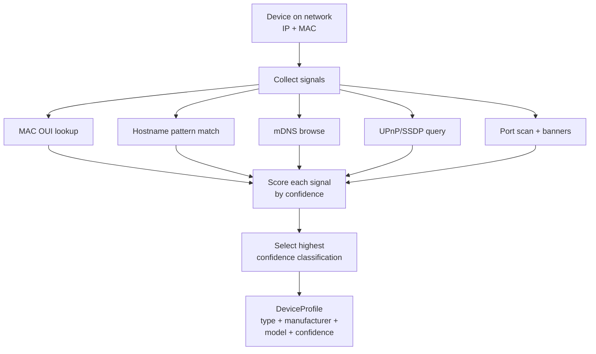

# Device Fingerprinting

> Device fingerprinting combines multiple network signals — MAC addresses, hostnames, service broadcasts, and open ports — to identify what a device is, who made it, and what OS it's running, turning raw IP/MAC pairs into meaningful device profiles.

## What it is

Device fingerprinting is the practice of collecting multiple "signals" from a device on your network and combining them to identify the device's type (smartphone, printer, router, smart TV), manufacturer, model, and operating system.

A single signal is often unreliable. A MAC address tells you the vendor, a hostname might say "iPhone," and an open port 443 could be any HTTPS server. But when you combine all these signals — MAC OUI (Organizationally Unique Identifier), hostname patterns, mDNS service advertisements, UPnP device descriptions, and port signatures — you get a high-confidence profile.

Instead of seeing an unknown IP like 192.168.1.42, you identify it as "Espressif ESP8266 (IoT) running web server on port 80."

## Why it matters for your network

Device fingerprinting solves real problems on home networks:

- **Device inventory**: Know what's actually connected. Identify surprise devices (rogue IoT gadgets, guests' phones, your partner's Bluetooth speakers).
- **Security**: Detect unusual devices on the network. If you've never seen a Chromecast before and one suddenly appears, that's worth investigating.
- **Troubleshooting**: "Why is the network slow?" — Fingerprinting tells you it's not your laptop, but a large number of IoT devices uploading data.
- **Network health**: Categorize devices by type and monitor them separately. Your printer's traffic patterns are different from your laptop's; fingerprinting helps monitor each appropriately.
- **MAC randomization workaround**: Modern phones randomize their MAC addresses for privacy. Fingerprinting via mDNS or UPnP lets you still identify them.
- **Device naming**: Assign friendly names to devices based on their profile. "Bedroom Sonos" is more useful than "AA:BB:CC:DD:EE:FF."

## How it works

Device fingerprinting uses a **layered, confidence-scoring approach**. No single signal is trusted; instead, multiple sources are queried and ranked by confidence.

### Layer 1: Passive signals (from existing data)

These require no active probing:

- **MAC OUI lookup** — Extract manufacturer from the MAC address's first three octets (e.g., `a4:ae:11` → Apple). Fast but imprecise; many Apple devices are Macs, iPhones, or iPads.
- **Hostname pattern matching** — Regex against known device patterns (e.g., `^iPhone` → smartphone, `^NPI[A-F0-9]` → printer, `^ESP_` → IoT). Confidence varies; some users change hostnames.
- **Existing port data** — If a port scan was already performed, use port signatures (e.g., ports 22 + 80 + 8080 → Linux server, ports 445 + 139 → Windows).

### Layer 2: Active probing (when needed)

These queries are sent to the device:

- **mDNS browsing** — Query `.local` services (e.g., `_airplay._tcp`, `_printer._tcp`, `_homekit._tcp`). mDNS is Bonjour; Apple devices, printers, and HomeKit devices advertise here. Includes TXT records with metadata (model, firmware version, etc).
- **UPnP/SSDP discovery** — Send M-SEARCH and parse XML device descriptions. Routers, printers, media renderers, NAS boxes advertise here. Returns friendly names, manufacturers, model numbers.
- **Port scanning** — Look for open ports and their banners (e.g., "Apache 2.4.41" on 80 suggests a Linux web server; "IIS 10.0" suggests Windows).

### Layer 3: Classification and confidence scoring

Once all signals are collected, they're ranked by priority and confidence:

1. **UPnP** (highest priority) — Provides rich structured data (manufacturer, model, friendly name). Confidence: 0.95.
2. **mDNS services** — Service types like `_homekit._tcp` are highly indicative. Confidence: 0.85–0.95 depending on service.
3. **Port signatures** — Specific port combinations (e.g., 22 + 25 + 110 → mail server). Confidence: 0.70–0.80.
4. **Hostname patterns** — Regex match. Confidence: 0.70–0.90 depending on pattern specificity.
5. **MAC vendor** (lowest priority) — Fallback, less specific. Confidence: 0.40–0.50.

The highest-confidence signal wins. If UPnP identifies a device as "Naim Uniti Atom" with 0.95 confidence, mDNS saying it's a "media device" at 0.80 is ignored.

### Confidence scoring

Each classification includes a confidence score (0.0 to 1.0) and the method used (`upnp`, `mdns`, `ports`, `hostname`, `mac_vendor`). A score of 0.9+ is high confidence; below 0.5 is uncertain. Users can filter by confidence threshold if they prefer conservative classifications.

## MAC Randomization: The Privacy Problem

Modern phones (iOS 8+, Android 6+) randomize their MAC address to privacy concerns. A randomized MAC has the **locally administered bit** set (second-least-significant bit of the first octet is 1; MAC matches `[0-9a-f][13579bdf]:...`).

Example: `a6:bb:cc:dd:ee:ff` vs `a4:bb:cc:dd:ee:ff` (the second is real, the first randomized).

Fingerprinting detects randomization and flags it, but the device can still be identified via mDNS or UPnP if it advertises them (most phones don't). This is why multiple signal sources matter.

## Signal Sources: What netglance collects

| Signal | Source | What it tells you | Confidence |
|--------|--------|------------------|-----------|
| MAC OUI | First 3 octets of MAC address | Manufacturer (Apple, Cisco, etc) | Medium |
| MAC randomization | Locally administered bit | If MAC is randomized for privacy | N/A (flag only) |
| Hostname | ARP table, DHCP, DNS reverse lookup | Device name (e.g., "iPhone", "Printer") | Medium–High |
| mDNS services | Browse `_service._tcp.local` | Service type (_homekit, _airplay, etc) | High |
| mDNS TXT records | Metadata in mDNS service responses | Model, firmware, features (model=ML771LL, etc) | High |
| UPnP device type | SSDP M-SEARCH + XML description | Device category (MediaRenderer, Printer, etc) | High |
| UPnP manufacturer/model | XML device description | Full manufacturer and model string | Very High |
| Open ports | Port scan (if performed) | Services running (22=SSH, 80=HTTP, etc) | Medium–High |
| Port banners | Banner grab from open ports | Software version (Apache 2.4, nginx 1.19, etc) | High |
| TCP/IP stack fingerprint | TTL, window size, fragmentation | Hint at OS type (Linux, Windows, macOS, iOS) | Low–Medium |

## What netglance checks

See [`tools/identify.md`](../../reference/tools/identify.md) for the `identify` command, which performs full-device fingerprinting:

- **MAC address parsing** — Extract vendor, detect randomization
- **Hostname classification** — Match against known device type patterns
- **mDNS service browsing** — Query 15+ service types and extract TXT records
- **UPnP device discovery** — Send SSDP M-SEARCH, fetch and parse XML
- **Port signature lookup** — Classify by open port combinations
- **Confidence scoring** — Score each classification method and return the best
- **Batch fingerprinting** — Profile all devices on the network at once

## Key terms

- **OUI** — Organizationally Unique Identifier; the first three octets (24 bits) of a MAC address assigned to a manufacturer.
- **MAC vendor** — The manufacturer associated with an OUI (e.g., OUI `a4:ae:11` → Apple).
- **Locally administered bit** — The second-least-significant bit of the first octet of a MAC address. When set, the MAC is locally administered (random), not universally unique.
- **mDNS** — Multicast DNS; Bonjour protocol for service discovery on local networks. Uses `.local` TLD. No central server needed.
- **Service type** — mDNS service classification (e.g., `_http._tcp`, `_printer._tcp`, `_homekit._tcp`). Format: `_service._protocol`.
- **TXT record** — mDNS metadata in key=value format (e.g., `model=ML771LL`, `firmware=1.2.3`).
- **UPnP** — Universal Plug and Play; protocol for device discovery and control. Used by routers, printers, media devices.
- **SSDP** — Simple Service Discovery Protocol; the multicast mechanism UPnP uses to advertise presence.
- **M-SEARCH** — SSDP multicast query sent to port 1900 to discover devices.
- **Device description XML** — UPnP XML file containing device metadata (friendlyName, manufacturer, modelName, deviceType, etc).
- **Port signature** — Association between open ports and device type (e.g., ports 22+80+8080 → Linux server).
- **Banner grabbing** — Connecting to a service and reading its response header to infer software version.
- **Confidence score** — Numeric score (0.0–1.0) representing certainty of a classification. Higher is more confident.
- **Classification method** — Which signal method provided the best classification (`upnp`, `mdns`, `ports`, `hostname`, `mac_vendor`).

## Further reading

- [IEEE 802 MAC Address Format](https://standards.ieee.org/standard/802-11-2020.html)
- [UPnP Device Architecture](https://openconnectivity.org/upnp-specs/upnp-device-architecture-1-0-20080424.pdf)
- [Zeroconf / Bonjour Specification](https://datatracker.ietf.org/doc/html/rfc6762)
- [SSDP / UPnP Discovery](https://openconnectivity.org/upnp-specs/upnp-device-architecture-1-0-20080424.pdf)
- RFC 6762 — mDNS specification
- RFC 3927 — IPv4 Link-Local addresses (used by mDNS)
