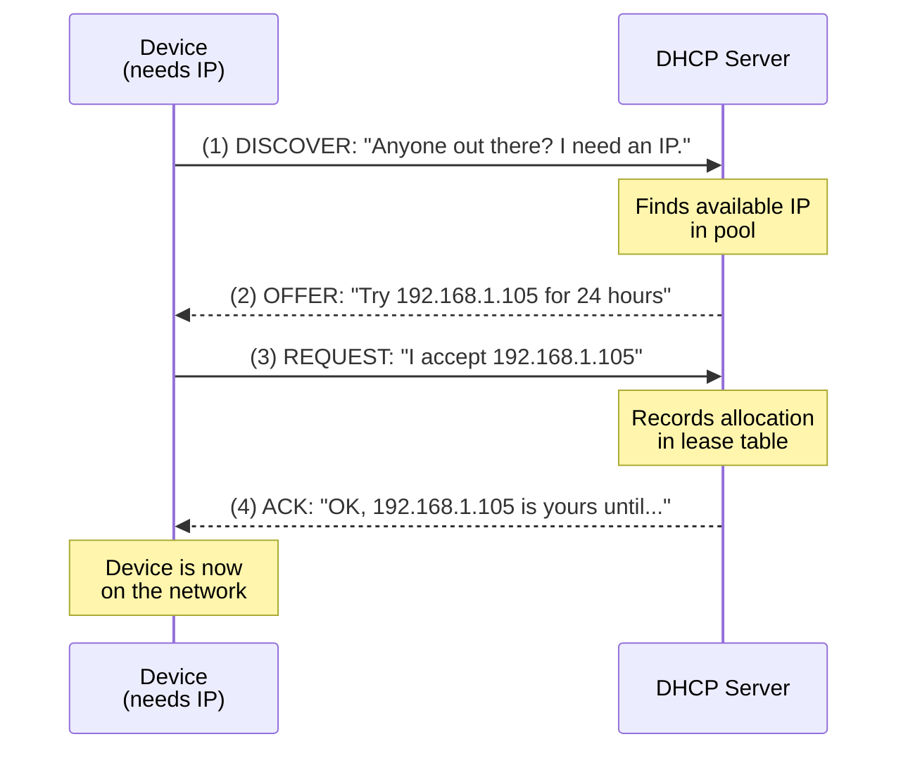

# DHCP: How It Works

> DHCP (Dynamic Host Configuration Protocol) automatically assigns IP addresses and network settings to devices when they join your network. Without it, you'd manually configure every device with an IP, gateway, and DNS server.

## What it is

DHCP is the system that hands out network configuration to devices. When your phone, laptop, or smart TV connects to your home network, DHCP tells it:

- What IP address to use (e.g., 192.168.1.105)
- The default gateway (router IP, usually 192.168.1.1)
- Which DNS servers to use (for translating domain names to IPs)
- The network mask (which other IPs are on the same network)
- Lease duration (how long until the device must renew)

Without DHCP, you'd manually type all this into every device. DHCP makes it automatic.

## Why it matters for your network

DHCP is critical to your network's function, and problems here cascade quickly:

- **No IP assignment** — If your DHCP server fails, new devices can't join the network. Even devices already connected may stop working when their leases expire.
- **Rogue DHCP servers** — An attacker can plug in an unauthorized DHCP server that responds faster than the real one, tricking devices into using a fake gateway or DNS server. All traffic can then be redirected or intercepted.
- **IP conflicts** — If two devices get the same IP, both become unreachable.
- **Wrong gateway/DNS** — If a rogue server provides a bad gateway or DNS server, devices can't reach the internet or will be phished.
- **Lease expiration** — If a device's lease expires and can't renew, it loses connectivity.

## How it works

### The DORA Handshake

DHCP uses a four-step dance called **DORA** (Discover, Offer, Request, Acknowledge):

**Step 1: DISCOVER**
The device (client) broadcasts a message on the network: "I'm here and I need an IP address." It doesn't know the DHCP server's location yet, so it shouts on the local network.

**Step 2: OFFER**
The DHCP server hears the Discover and responds with an offer: "I have IP 192.168.1.105 available. You can use it for 24 hours." The offer includes the lease duration and other options like gateway and DNS.

**Step 3: REQUEST**
The client says back: "Thank you, I accept 192.168.1.105." (If multiple servers offered IPs, the client picks one and tells the others "no thanks.")

**Step 4: ACK (Acknowledge)**
The server confirms: "Done. 192.168.1.105 is yours. Your lease expires on [date/time]." The device is now configured and online.

### What DHCP Provides

Beyond just an IP address, DHCP can provide:

| Option | Example | Purpose |
|--------|---------|---------|
| IP Address | 192.168.1.105 | Client's address on the network |
| Subnet Mask | 255.255.255.0 | Defines which IPs are local vs remote |
| Default Gateway | 192.168.1.1 | The router; where to send non-local traffic |
| DNS Servers | 8.8.8.8, 8.8.4.4 | Resolvers for domain name lookups |
| Domain Name | mynetwork.local | Primary DNS search domain |
| Lease Time | 86400 (1 day) | Seconds until lease expires |
| NTP Servers | 0.pool.ntp.org | Time synchronization |
| DHCP Server ID | 192.168.1.1 | Which server issued this lease |

### Leases and Renewal

A DHCP lease isn't permanent — it expires. Here's the lifecycle:

1. **Initial lease** — Device gets an IP for, say, 24 hours.
2. **T1 (50% of lease)** — After 12 hours, the device tries to renew. It contacts the original DHCP server and asks: "Can I keep this IP?"
3. **T2 (87.5% of lease)** — If the original server doesn't respond, the device broadcasts to all DHCP servers: "Can anyone renew this lease?"
4. **Lease expiration** — If neither works, the device loses the IP and must restart DORA from scratch.
5. **Renewal success** — Server extends the lease another 24 hours and the cycle continues.

**Why this matters:**
- **Short leases** (1-4 hours) mean IPs change frequently. Useful if you have many devices joining/leaving (coffee shops, hotels). Stressful for devices trying to maintain long connections.
- **Long leases** (24 hours) are typical for home networks. Devices keep the same IP, reducing churn on the network.
- **Very long leases** (weeks/months) can leave stale IPs in the pool if a device dies without releasing.

### Lease Release

When a device leaves the network gracefully (shutdown, disconnect), it sends a **RELEASE** message: "I'm done with this IP, return it to the pool." This frees it up immediately for another device. (Ungraceful shutdowns don't release, so the IP sits reserved until the lease expires.)

## Rogue DHCP Servers: The Security Risk

A **rogue DHCP server** is an unauthorized DHCP server on your network. Here's the attack:

1. Attacker plugs a device (laptop, Raspberry Pi) into your network.
2. It runs a DHCP server that responds to Discover packets.
3. It offers IPs faster than the legitimate DHCP server (usually the router).
4. Devices prefer the first response and accept the rogue server's offer.
5. The rogue server provides a **fake gateway** (its own IP) or **fake DNS** (an attacker's DNS server).
6. All traffic flows through the attacker, who can intercept, modify, or redirect it.

**Example attack scenario:**
- You connect to your home WiFi. Your device broadcasts a DHCP Discover.
- The attacker's rogue server responds first with: "Use 192.168.1.50 as your IP, 192.168.1.100 as your gateway [attacker's machine]."
- Your device accepts the offer and sends all internet traffic through 192.168.1.100 (the attacker).
- The attacker can now see everything: bank logins, emails, passwords.

Alternatively, the rogue server provides a fake DNS server IP, so all your DNS queries go to the attacker, who can redirect you to phishing sites.

## What netglance checks

See [`tools/dhcp.md`](../../reference/tools/dhcp.md) for detailed DHCP diagnostics:

- **DHCP server discovery** — Identifies which servers are responding on your network.
- **Rogue server detection** — Flags unauthorized DHCP servers by capturing Offer/ACK packets and comparing server IPs.
- **Current lease inspection** — Shows your device's current IP, gateway, DNS, and lease duration.
- **Lease health** — Checks if your lease is about to expire (T1/T2 timers).
- **DHCP traffic analysis** — Monitors Discover, Offer, Request, ACK packets to spot anomalies.
- **Fingerprinting** — Uses DHCP Option 55 (Parameter Request List) to identify the OS/device requesting the lease.

## Key terms

- **DHCP** — Dynamic Host Configuration Protocol; the system that automatically assigns IP addresses and network settings.
- **Lease** — A time-limited grant of an IP address. Expires after the lease duration (e.g., 24 hours).
- **DORA** — Discover, Offer, Request, Acknowledge; the four-step DHCP handshake.
- **Discover** — A broadcast message from a client asking "Who has DHCP?"
- **Offer** — A DHCP server's response offering an available IP and configuration.
- **Request** — A client's formal acceptance of an offered IP.
- **ACK (Acknowledge)** — Server's confirmation that the lease is granted.
- **T1 Timer** — Renewal timer at 50% of lease time; device asks the original server to renew.
- **T2 Timer** — Rebinding timer at 87.5% of lease time; device broadcasts to all DHCP servers.
- **DHCP Option** — A configuration parameter (e.g., Option 3 = gateway, Option 6 = DNS).
- **Rogue DHCP Server** — An unauthorized DHCP server on the network that can redirect traffic or DNS queries.
- **DHCP Starvation** — Attacking the DHCP server by requesting all available IPs, preventing legitimate devices from getting IPs.
- **DHCP Relay** — A device (not the router) that forwards DHCP messages between clients and a remote DHCP server.
- **DHCP Snooping** — A switch feature that filters rogue DHCP packets.
- **Release** — A message from a client returning an IP back to the pool.
- **Subnet Mask** — Defines which IPs are on the same local network (e.g., 255.255.255.0 means /24 network).
- **Default Gateway** — The router's IP; where devices send traffic destined for networks outside the local one.

## Further reading

- [`tools/dhcp.md`](../../reference/tools/dhcp.md) — netglance's DHCP tool reference
- [`concepts/arp-and-mac-addresses.md`](arp-and-mac-addresses.md) — ARP is closely related; DHCP uses ARP to detect IP conflicts
- [IETF RFC 2131 — DHCP Specification](https://tools.ietf.org/html/rfc2131)
- [Cloudflare: What is DHCP?](https://www.cloudflare.com/learning/network-layer/what-is-dhcp/)
- [OWASP: DHCP Spoofing](https://owasp.org/www-community/attacks/dhcp_spoofing)
