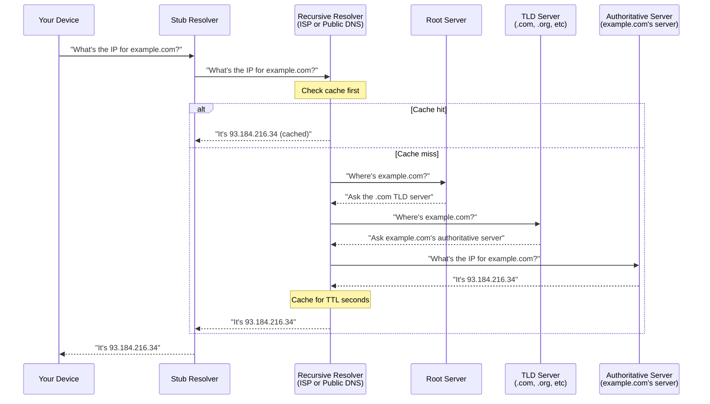

# DNS Explained

> DNS translates human-readable domain names (google.com) into IP addresses (142.251.41.14) that your device needs to actually connect to servers on the internet.

## What it is

DNS (Domain Name System) is the internet's address book. When you type a URL into your browser or your app connects to a server, the system needs to know the IP address of that destination. DNS is the service that looks up and returns that IP address.

Without DNS, you'd have to remember and type IP addresses everywhere. Instead, DNS lets you use memorable names like `github.com` or `spotify.com`.

## Why it matters for your network

DNS is a single point of failure on your home network. Here's what can go wrong:

- **Misconfigured DNS**: If your resolver is slow or unresponsive, every web request stalls. Your network looks offline even if you have connectivity.
- **DNS hijacking**: An attacker or compromised router can intercept DNS queries and redirect you to malicious sites. You think you're visiting your bank's website, but you're on a phishing clone.
- **DNS leaks**: If you use a VPN but your DNS queries bypass the VPN, your ISP (or anyone monitoring your network) can see every domain you visit — defeating the privacy purpose of the VPN.
- **Stale caches**: If DNS records change but your cache doesn't know, you'll connect to an old IP address — a server that may no longer exist or belong to someone else.
- **DNSSEC validation failures**: Unsigned or tampered DNS responses can cause legitimate sites to become unreachable.

## How it works

### The DNS Resolution Flow

When you request a domain, a chain of servers looks it up:

### The Servers Involved

**Stub Resolver**
Your device's built-in DNS client. It doesn't do the heavy lifting — it just asks a recursive resolver on your behalf.

**Recursive Resolver**
Usually your ISP's DNS server or a public one (like Cloudflare's 1.1.1.1 or Google's 8.8.8.8). It does all the work: it queries root servers, TLD servers, and authoritative servers, then returns the answer. It also caches results so future queries are instant.

**Root Servers**
Thirteen globally distributed servers that know where to find every TLD (.com, .org, .net, etc). They don't know individual domain IPs — just which server to ask next.

**TLD (Top-Level Domain) Servers**
Handle all domains ending in a specific TLD (.com, .gov, .uk, etc). They know which authoritative server handles each domain but not the actual IP addresses.

**Authoritative Server**
The "source of truth" for a domain. Owned by the domain's registrant or their DNS hosting provider. It has the actual IP address (A or AAAA record) and other DNS records for that domain.

### Caching and TTL

Caching happens at multiple levels:

1. **Your device's stub resolver** caches for minutes or hours (OS-dependent)
2. **Recursive resolver** caches aggressively — this is where most speedup happens
3. **Your browser** may cache DNS entries
4. **ISP or public DNS resolver** caches as well

Each DNS record has a **TTL (Time To Live)** — a number of seconds the record is considered valid. A TTL of 300 means "cache this for 5 minutes." High TTLs (3600+) improve performance but mean stale data persists longer. Low TTLs (60 or less) mean faster updates but more queries to the authoritative server.

If a domain's IP changes but the recursive resolver still has the old IP cached, you'll connect to the old address until the cache expires.

## Recursive vs Authoritative DNS

**Recursive Resolver** (used by you)
- Asks questions on your behalf
- Follows the chain of servers to find an answer
- Caches the results
- Examples: your ISP's resolver, Cloudflare (1.1.1.1), Google (8.8.8.8), Quad9 (9.9.9.9)
- What matters: speed, privacy, availability, DNSSEC validation

**Authoritative Server** (owned by domain registrant)
- Holds the actual DNS records for a domain
- Answers questions about its own domain only
- Never caches
- Examples: AWS Route 53, Cloudflare, Dyn, your domain registrar's servers
- What matters: uptime, fast propagation, DNSSEC signing

## DNSSEC: Signed Answers

DNSSEC (DNS Security Extensions) cryptographically signs DNS responses so you can verify they weren't tampered with.

**How it works:**
- The authoritative server signs its DNS records with a private key
- The signature (and public key) are published as RRSIG records
- Your recursive resolver verifies the signature using the public key
- There's a chain of trust: root → TLD → authoritative server

**Chain of Trust:**
Each level proves the next. The root server signs the TLD server's public key. The TLD server signs the authoritative server's public key. Finally, the authoritative server signs the actual DNS records (A, AAAA, etc).

**Why it's incomplete:**
DNSSEC adoption is still ~40% of domains globally. It adds latency (signature verification) and complexity. Many resolvers don't fully validate, and some ISPs block DNSSEC responses.

## Privacy: DoH and DoT

Traditional DNS queries travel in plaintext. Your ISP (or anyone on your network) can see every domain you visit.

**DNS-over-HTTPS (DoH)**
- DNS queries wrapped in HTTPS (encrypted)
- Indistinguishable from regular web traffic
- Supported by Firefox, Chrome, most mobile OSes
- Public DoH providers: Cloudflare (1.1.1.1), Google (8.8.8.8), Quad9 (9.9.9.9)

**DNS-over-TLS (DoT)**
- DNS queries over TLS (port 853)
- Not as widely supported as DoH
- Uses dedicated port (easier to detect/block)
- Supported by some routers and mobile devices

**Trade-off:** DoH/DoT hide your queries from your ISP but move trust to the public DNS provider (Cloudflare, Google, etc). Choose based on who you trust more.

## DNS Hijacking

When someone intercepts your DNS queries and returns false IP addresses.

**Common attacks:**
- **Malware on your device** modifies resolver settings to point to an attacker's DNS server
- **Compromised router** redirects all DNS queries to attacker's server
- **ISP tampering** your ISP returns ads or blocks adult content by hijacking DNS
- **Rogue WiFi access point** claims to be your network, intercepts queries

**Result:** You think you're visiting google.com, but you're on attacker.com instead. Perfect for phishing, malware distribution, or redirecting to ad networks.

## DNS Leaks

A DNS leak occurs when your DNS queries bypass your VPN and go directly to your ISP's resolver, revealing your browsing activity.

**How it happens:**
1. You connect to a VPN (thinking all traffic is encrypted and routed through the VPN)
2. But your device is still configured to use your ISP's DNS resolver
3. DNS queries go in plaintext to the ISP, not through the VPN tunnel
4. Your ISP logs every domain you visit, defeating the VPN's privacy purpose

**Common causes:**
- VPN doesn't override DNS settings (Windows issue)
- IPv6 DNS queries leak even if IPv4 is protected
- DHCP re-assigns resolver after VPN connects
- Some mobile networks force specific DNS servers

**Fix:** Use VPN providers that include DNS protection, or manually set DoH/DoT resolvers.

## What netglance checks

See [`tools/dns.md`](../../reference/tools/dns.md) for detailed DNS health checks:

- **DNS resolver validation** — Is your resolver reachable and responding?
- **Resolution time** — How long do queries take? Is your resolver slow?
- **DNS leak detection** — Are queries leaking outside your VPN?
- **DNSSEC validation** — Does your resolver validate DNSSEC signatures?
- **Resolver configuration** — What resolver is your device currently using?
- **DNS response correctness** — Are you getting back real IP addresses?

## Key terms

- **DNS** — Domain Name System; the protocol that translates domain names to IP addresses
- **Resolver** — Any DNS server that answers your queries (usually recursive resolver)
- **Recursive Resolver** — DNS server that follows the chain of lookups on your behalf and caches results
- **Authoritative Server** — DNS server that holds the actual records for a domain
- **A Record** — Maps a domain name to an IPv4 address (e.g., example.com → 93.184.216.34)
- **AAAA Record** — Maps a domain name to an IPv6 address
- **CNAME** — Canonical Name; alias that points one domain to another (e.g., www.example.com → example.com)
- **TTL (Time To Live)** — Number of seconds a DNS response is cached before needing a fresh lookup
- **DNSSEC** — DNS Security Extensions; cryptographic signatures on DNS responses
- **DoH** — DNS-over-HTTPS; encrypted DNS queries wrapped in HTTPS
- **DoT** — DNS-over-TLS; encrypted DNS queries over TLS (port 853)
- **DNS Hijacking** — Intercepting DNS queries and returning false IP addresses
- **DNS Leak** — DNS queries bypassing a VPN and revealing your ISP resolver
- **Root Server** — One of thirteen globally distributed servers that know where TLD servers are
- **TLD** — Top-Level Domain; the rightmost part of a domain (.com, .org, .uk, etc)
- **Zone** — A domain and all its subdomains, managed by one authoritative server
- **Forward Lookup** — Translating a domain name to an IP address (the common case)
- **Reverse Lookup** — Translating an IP address back to a domain name (slower, less reliable)

## Further reading

- [ICANN: How DNS Works](https://www.icann.org/en/articles/26)
- [Cloudflare: What is DNS?](https://www.cloudflare.com/learning/dns/what-is-dns/)
- [Cloudflare: DNSSEC](https://www.cloudflare.com/learning/dns/dnssec/what-is-dnssec/)
- [Mozilla Docs: DNS over HTTPS](https://support.mozilla.org/en-US/kb/dns-over-https)
- [OWASP: DNS Hijacking](https://owasp.org/www-community/attacks/dns_hijacking)
- RFC 1035 — DNS specification
- RFC 4034 — DNSSEC protocol
- RFC 8484 — DNS over HTTPS
- RFC 7858 — DNS over TLS
