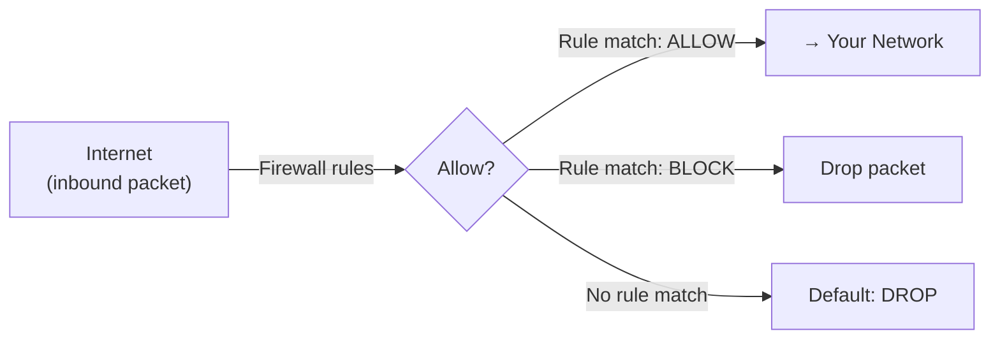
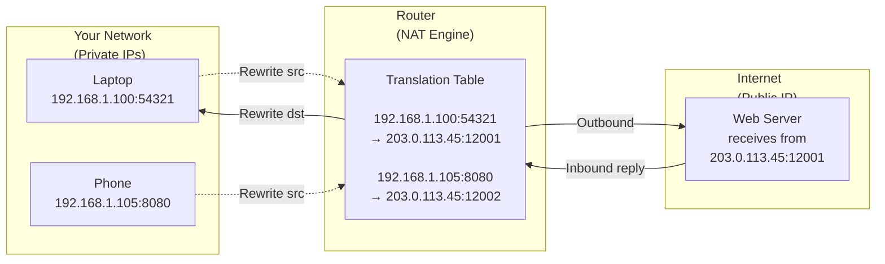

# Firewalls and NAT

> Your router's firewall and NAT are your primary defense against unsolicited inbound traffic. But misconfigured port forwarding and UPnP can punch holes in that defense—and most home networks don't even check what's leaking outbound.

## What it is

A **firewall** is a set of rules that decide which network traffic is allowed in or out of your network. Your router contains one; your computer likely has another. A firewall examines packets by protocol (TCP, UDP), port (22, 443, etc.), and direction (inbound, outbound) and applies rules: allow, block, or drop.

**Network Address Translation (NAT)** is the mechanism that lets your entire home network share a single public IP address with the internet. Your router maintains a translation table: when your laptop (192.168.1.100) sends a request to a server, the router rewrites the source address to its public IP, and records the mapping. When the reply comes back, NAT translates it back to the private IP and routes it to your laptop.

In practice, **firewalls and NAT are inseparable**. Your router combines both: NAT allows private IPs to reach the internet, and the firewall blocks unsolicited inbound traffic that isn't part of an outbound connection you initiated. Together, they form the defensive perimeter of your home network.

## Why it matters for your network

### Your first line of defense
The router firewall is the main barrier between your internal devices and the internet. Misconfigured firewalls leave ports open that should be blocked. Port forwarding creates explicit holes for services you want to expose (like a home server) but also increases your attack surface if that service has vulnerabilities.

### Egress filtering is overlooked
Most users think "firewall" means blocking inbound attacks. But a compromised device can also leak data *outbound*—a malware-infected laptop phoning home to attackers, or a poorly-configured IoT device exfiltrating user data. Egress filtering (blocking certain outbound ports) is rare in home networks but increasingly important.

### NAT provides incidental security
NAT creates a side effect: unsolicited inbound traffic is automatically dropped because the router has no translation entry for it. This is not the firewall's job—it's NAT's side effect. If you misconfigure port forwarding or enable UPnP (automatic port forwarding), you've punched a hole in this protection.

### UPnP and port forwarding risks
**UPnP (Universal Plug and Play)** allows devices on your LAN to automatically request port forwards on your router without authentication. A malicious app or compromised device can open ports on your router—potentially exposing a vulnerable service to the internet.

## How firewalls work

A firewall examines each packet and applies rules in order:



### Stateful inspection

Modern firewalls are **stateful**: they track connection state. When your laptop initiates a connection to google.com (outbound TCP port 443), the firewall records it as an open *flow*. The reply from google.com is allowed *because the firewall remembers the outgoing connection*. An unsolicited packet from google.com would be dropped (no matching outbound flow).

```mermaid
sequenceDiagram
    participant Your Laptop as Your Laptop<br/>(192.168.1.100)
    participant Firewall as Router Firewall
    participant Internet as Internet<br/>(google.com)

    Your Laptop->>Firewall: SYN (port 443)<br/>Outbound to google.com
    Firewall->>Firewall: Record state:<br/>Flow 192.168.1.100:12345<br/>→ google.com:443
    Firewall->>Internet: (allow, forward packet)
    Internet->>Firewall: SYN-ACK (inbound)
    Firewall->>Firewall: Check state:<br/>Inbound matches open flow?<br/>YES ✓
    Firewall->>Your Laptop: (allow, forward reply)
    Your Laptop->>Internet: Send data
```

### Egress vs ingress filtering

- **Ingress (inbound)**: Rules that block unsolicited traffic coming from the internet. This is what most firewalls emphasize. Default: drop unsolicited inbound.
- **Egress (outbound)**: Rules that restrict which outbound ports your internal devices can use. Example: block port 25 (SMTP) to prevent spam relay. Default: allow all outbound (most home routers).

## How NAT works

NAT maintains a **translation table** (the "NAT table") that maps private addresses to the public IP:



When your laptop sends a packet to a web server, the router:
1. Rewrites the source address from `192.168.1.100:54321` to its public IP (`203.0.113.45:12001`)
2. Records the mapping in the NAT table
3. The reply comes back to the router's public IP, which looks up the mapping and forwards it to your laptop at `192.168.1.100:54321`

This is **stateful NAT**: the translation table is temporary and expires after inactivity.

### Why NAT provides security (and why it's not a firewall)

Inbound traffic from the internet has no matching entry in the NAT table, so the router drops it by default. **This is not a firewall rule—it's a side effect of NAT.** There's no translation entry for unsolicited inbound packets because no internal device initiated a connection for them.

This is why NAT alone blocks much external scanning, but it's not a true firewall. A true firewall has explicit rules; NAT just translates addresses.

## Port forwarding and UPnP

### Port forwarding (manual)

You can manually configure your router to forward specific inbound ports to internal devices:

```
Rule: Forward inbound port 8080 → 192.168.1.150:8080
```

When someone tries to reach your public IP on port 8080, the router forwards it to the internal device at `192.168.1.150:8080`. This creates an explicit hole in the NAT firewall for that port and device. Use it for services you intentionally expose (web server, game server, etc.), but only after ensuring that service is secure.

### UPnP (automatic port forwarding)

**UPnP (Universal Plug and Play)** lets applications inside your network automatically request port forwards from your router:

1. Your game app says: "Forward inbound port 27015 (game server) to me"
2. Router receives request (no authentication required) and creates the rule
3. External players can now connect to your game server

**Risk**: A malicious app or compromised device can request port forwards without your knowledge. Botnet malware, for example, might open a port to accept commands from attackers.

**Mitigation**: Disable UPnP in your router settings unless you have a specific application that requires it.

## What netglance checks

### [`tools/firewall.md`](../../reference/tools/firewall.md)

The **firewall auditor** tests:

- **Egress port openness**: Checks common outbound ports (22, 25, 53, 80, 443, 587, 993, 8080, 8443) to see if your ISP or router is blocking them. Port 25 (SMTP) is often blocked to prevent spam relay.
- **Ingress exposure**: Attempts to reach your public IP on specified ports from an external service to detect open ports exposed to the internet. Requires external probe infrastructure.
- **Port expectations vs reality**: If you've configured port forwarding for a service, netglance can verify that it's actually reachable from outside, or confirm that a port you meant to close is now blocked.

### [`tools/scan.md`](../../reference/tools/scan.md)

The **port scanner** complements the firewall audit:

- **Local network scanning**: Scans devices on your LAN to see which ports and services are listening. Used to detect unexpected services or misconfigurations.
- **Service enumeration**: Identifies the service running on each open port (SSH, HTTP, etc.), helping you match against your expectations.

### [`tools/ipv6.md`](../../reference/tools/ipv6.md)

**IPv6 bypasses NAT**—each device gets its own global IPv6 address. The firewall rules that protect IPv4 may not apply to IPv6 traffic, leaving devices exposed even if IPv4 is locked down. netglance checks for inadvertent IPv6 exposure.

## Key terms

| Term | Definition |
|------|-----------|
| **Firewall** | A set of rules that allow or block network traffic by port, protocol, source, and direction. |
| **Stateful firewall** | A firewall that tracks connection state and allows return traffic for connections initiated internally. |
| **NAT (Network Address Translation)** | The mechanism that translates private IP addresses to a public IP for outbound traffic and back for inbound replies. |
| **PAT (Port Address Translation)** | Variant of NAT that also translates ports (e.g., `192.168.1.100:54321` → `203.0.113.45:12001`). Most home routers use PAT. |
| **NAT table** | The translation table maintained by the router, mapping private addresses to public addresses and ports. Entries expire after inactivity. |
| **Port forwarding** | A manual router rule that forwards inbound traffic on a port to a specific internal device. |
| **UPnP (Universal Plug and Play)** | A protocol that allows applications to automatically request port forwards from the router without manual configuration or authentication. |
| **Egress filtering** | Firewall rules that restrict outbound traffic (e.g., block port 25 to prevent spam relay). |
| **Ingress filtering** | Firewall rules that restrict inbound traffic. Default on home routers: drop unsolicited inbound. |
| **DMZ (Demilitarized Zone)** | A router setting that forwards all inbound traffic to a single internal device. Useful for testing but risky if that device is compromised. |
| **CGNAT (Carrier-Grade NAT)** | When your ISP applies NAT (you don't have a true public IP). Prevents inbound port forwarding entirely. |
| **Stateful inspection** | Firewall mechanism that remembers outbound connections and automatically allows return traffic. |

## Further reading

- **[tools/firewall.md](../../reference/tools/firewall.md)** — How to use netglance's firewall auditor.
- **[tools/scan.md](../../reference/tools/scan.md)** — Port scanning and service detection on your LAN.
- **[tools/ipv6.md](../../reference/tools/ipv6.md)** — Why IPv6 is a firewall bypass.
- **RFC 3022**: [Traditional IP Network Address Translator (NAT)](https://tools.ietf.org/html/rfc3022) — the NAT specification.
- **OWASP**: [Insecure Direct Object References](https://owasp.org/www-project-web-security-testing-guide/) — understanding exposure risks.
