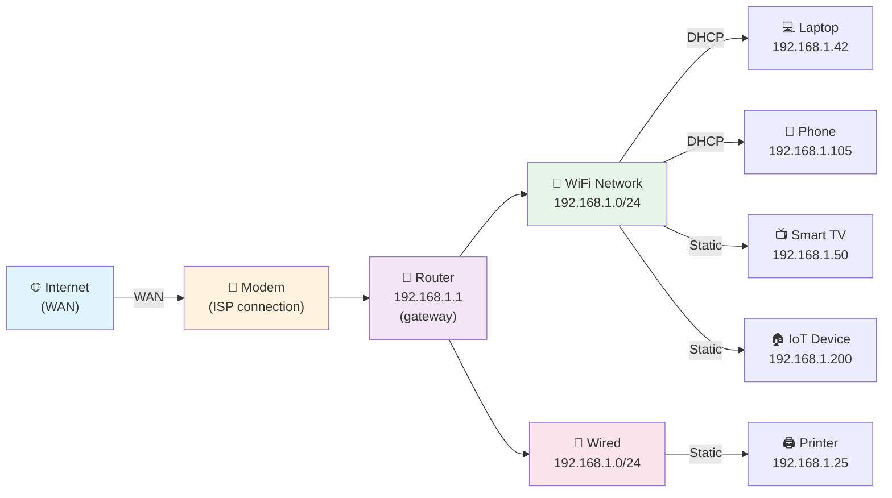

# How Networks Work

> Networks are how your devices talk to each other and the internet. Understanding the basics helps you diagnose connectivity problems and get the most out of netglance.

## What it is

A network is a group of computers and devices connected together so they can share information. Your home network includes your router, your laptop, your phone, smart speakers, and anything else connected via WiFi or Ethernet. These devices communicate using a shared language called the Internet Protocol (IP).

Every device on your network has an **IP address**—a unique numerical identifier, like `192.168.1.42`. This address is how devices find and talk to each other. Your network is divided into smaller groups called **subnets** so traffic stays organized. Your **router** acts as the gatekeeper, controlling what goes to the internet and what stays local.

## Why it matters for your network

If a device can't talk to others or reach the internet, it's usually a network configuration problem. Maybe it didn't get a valid IP address. Maybe the router isn't forwarding traffic correctly. Maybe a device is on the wrong subnet. By understanding how networks work, you can:

- Diagnose why a device loses connectivity
- Understand what netglance is telling you
- Plan your network layout (how many devices, what IP ranges, etc.)
- Spot security issues like unauthorized devices or address conflicts

## How it works

### IP Addresses

An IP address (IPv4) looks like `192.168.1.42`—four numbers separated by dots, each ranging from 0–255. Think of it like a mailing address: the router needs this to know where to send data.

Every device on your LAN (local area network) shares a common portion of the address. For example, if your router is at `192.168.1.1`, all your devices might be `192.168.1.x` (where `x` is unique per device). This shared portion is the **subnet**.

### Subnets and CIDR Notation

A subnet divides a network into logical groups. The notation `192.168.1.0/24` means:
- `192.168.1.0` is the network address
- `/24` means the first 24 bits (out of 32) identify the network; the remaining 8 bits identify individual hosts

In this `/24` subnet:
- `192.168.1.0` is the network address (reserved)
- `192.168.1.1` through `192.168.1.254` are usable device addresses
- `192.168.1.255` is the broadcast address (reserved, used to reach all devices at once)

Common home network sizes:
- `/24` (255 addresses): typical home network
- `/25` (128 addresses): small network
- `/16` (65,535 addresses): large network (rarely used at home)

### Default Gateway

Your **default gateway** is the device (usually your router) that forwards traffic destined for outside your LAN. If your laptop wants to reach Google, it sends the packet to the gateway, which then routes it toward the internet.

Every device needs to know its gateway's IP address. Without it, devices can only talk to others on the same subnet—no internet. The gateway is typically `x.x.x.1` in your subnet (e.g., `192.168.1.1`).

### LAN vs WAN

**LAN** (Local Area Network) = your home network. All devices here can talk directly using their private IP addresses.

**WAN** (Wide Area Network) = the internet. Your router connects your LAN to the WAN via your ISP (Internet Service Provider).

### NAT (Network Address Translation)

Your router uses NAT to translate between private and public IPs:
- **Inside**: devices use private addresses like `192.168.1.42`
- **Outside**: the ISP assigns your router one public IP (e.g., `203.0.113.45`)

When your laptop sends a request to Google, the router rewrites the "from" address to the public IP. When Google responds, the router rewrites it back to `192.168.1.42`. This keeps your device addresses hidden and conserves the limited pool of public IPs.

### DHCP Leases

DHCP (Dynamic Host Configuration Protocol) automatically assigns IP addresses to devices on your network. When you connect a phone to WiFi, the router's DHCP server hands it an address like `192.168.1.105` for a fixed time period—the **lease duration** (typically 24–48 hours).

When the lease expires, the device either:
1. Requests renewal (same or different address)
2. Loses connectivity and requests a new address

**Static assignment** means an administrator (you) manually assigns a specific IP to a device, bypassing DHCP. Useful for servers, printers, and IoT devices so their address doesn't change.

### Private vs Public IP

**Private IPs** (RFC 1918 ranges) are reserved for internal use:
- `10.0.0.0` – `10.255.255.255` (Class A)
- `172.16.0.0` – `172.31.255.255` (Class B)
- `192.168.0.0` – `192.168.255.255` (Class C)

Every home network uses private IPs. They're never routable on the public internet—ISPs drop them.

**Public IPs** are unique worldwide and routable on the internet. Your ISP assigns one to your router's WAN port. Servers and services use public IPs so anyone can reach them.

### Network Topology Diagram

In this diagram:
- The router is the hub connecting LAN devices to the modem (and internet)
- All LAN devices get private IPs in the `192.168.1.0/24` subnet
- Some devices use DHCP (auto-assigned), others have static IPs
- The router's DHCP server issues leases for devices like the laptop and phone

## What netglance checks

**`netglance discover`** — Scans your subnet to find all active devices and their IP addresses. Shows you what's connected right now.

**`netglance ping`** — Tests connectivity to a device (like your gateway or an internet host). Tells you if a device is reachable and how fast the response is.

**`netglance route`** — Traces the path packets take from your device to a destination (like `8.8.8.8`). Shows each hop (router, ISP gateway, etc.) along the way. Useful for diagnosing slow or broken paths.

**`netglance dns`** — Checks DNS resolution on your network. Ensures your gateway (or configured DNS server) is translating domain names to IPs correctly.

## Key terms

| Term | Definition |
|------|-----------|
| **IP Address** | A numerical identifier (e.g., `192.168.1.42`) assigned to each device on a network. |
| **Subnet** | A logical subdivision of a network. All devices in a subnet share a common IP prefix. |
| **CIDR Notation** | Shorthand for defining a subnet (e.g., `192.168.1.0/24`). The number after `/` is the network prefix length in bits. |
| **Subnet Mask** | Defines which part of an IP is the network and which is the host (e.g., `255.255.255.0` for `/24`). |
| **Gateway** | The router or device that forwards traffic between your LAN and the wider internet (WAN). |
| **LAN** | Local Area Network—your home network and all devices directly connected. |
| **WAN** | Wide Area Network—the internet and everything beyond your router. |
| **NAT** | Network Address Translation. Translates private IPs to public IPs for internet communication. |
| **DHCP** | Dynamic Host Configuration Protocol. Automatically assigns IP addresses and other network settings to devices. |
| **DHCP Lease** | The time period for which a DHCP-assigned IP address is valid. Expires and renews periodically. |
| **Private IP** | An IP address reserved for internal networks (RFC 1918 ranges: `10.x`, `172.16-31.x`, `192.168.x`). |
| **Public IP** | A globally routable IP address assigned by an ISP. Your router's WAN-facing address. |
| **Broadcast Address** | The last address in a subnet (e.g., `192.168.1.255`). Used to send messages to all devices at once. |
| **DNS** | Domain Name System. Translates human-readable names (e.g., `google.com`) to IP addresses. |

## Further reading

- [RFC 1918 — Private Internet Addresses](https://tools.ietf.org/html/rfc1918)
- [CIDR Notation Explained](https://en.wikipedia.org/wiki/Classless_Inter-Domain_Routing)
- [How DHCP Works](https://www.ionos.com/en/hosting/tutorials/what-is-dhcp)
- [NAT and Port Forwarding](https://en.wikipedia.org/wiki/Network_address_translation)
- [traceroute and Understanding Route Paths](https://en.wikipedia.org/wiki/Traceroute)
