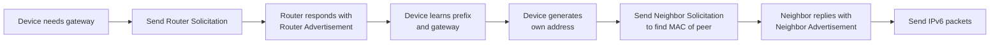

# IPv6: The Next-Generation Internet Protocol

> IPv6 expands the address space from 32 bits to 128 bits, eliminating NAT and making your devices potentially globally routable. Understanding your IPv6 exposure is critical for home network security.

## What it is

**IPv6** is the next-generation Internet Protocol, designed to replace IPv4. While IPv4 addresses are 32 bits (roughly 4 billion addresses), IPv6 uses 128 bits—enough to assign a unique address to every atom on Earth several times over. This vast address space eliminates the need for **Network Address Translation (NAT)**, the workaround that hides your devices behind your router's public IP.

IPv6 addresses are written in hexadecimal notation with colons:
```
2001:0db8:85a3:0000:0000:8a2e:0370:7334
```

Using shorthand (`::` collapses consecutive zeros):
```
2001:db8:85a3::8a2e:370:7334
```

## Why it matters for your network

Many ISPs now provide **dual-stack** service—your connection runs both IPv4 and IPv6 simultaneously. This creates new security concerns:

1. **No NAT = Direct Reachability**: Without NAT, devices on your network can be directly addressed from the internet. Your router's firewall must explicitly protect them; many don't have IPv6 firewall rules enabled by default.

2. **VPN Leaks**: IPv6 can bypass IPv4-only VPNs. If your VPN tunnel only covers IPv4, IPv6 traffic (including DNS queries) goes unencrypted and can reveal your location and browsing activity.

3. **Device Tracking**: Some IPv6 address generation methods embed your device's MAC address, allowing tracking across networks.

4. **Parallel Attack Surface**: Attackers no longer need to exploit IPv4; they can target IPv6 directly, often with less scrutiny and monitoring than IPv4 traffic.

## How it works

### IPv6 Address Types

| Type | Prefix | Purpose | Example |
|------|--------|---------|---------|
| **Link-local** | `fe80::/10` | Automatic, used on LAN only, never routed | `fe80::1` |
| **Global unicast** | `2000::/3` | Publicly routable, assigned by ISP | `2001:db8::1` |
| **Unique local** | `fd00::/8` | Private, like RFC1918 for IPv6 | `fd12:3456::1` |
| **Multicast** | `ff00::/8` | One-to-many, used for NDP and services | `ff02::1` |
| **Loopback** | `::1` | Local machine only, same as `127.0.0.1` | `::1` |

### Address Generation: SLAAC vs DHCPv6

Devices obtain IPv6 addresses in two ways:

**SLAAC (Stateless Address Auto-Configuration)**:
- The router sends a **Router Advertisement (RA)** with an IPv6 prefix (e.g., `2001:db8::/64`).
- Your device generates the second half (interface ID) by appending a 64-bit suffix.
- Historically, this suffix was derived from the device's MAC address using **EUI-64** encoding, creating a traceable identifier.
- Modern devices use **privacy extensions** (RFC 4941) to generate random temporary addresses instead.

**DHCPv6 (Stateful)**:
- Like DHCP for IPv4, a DHCPv6 server assigns a full address.
- Gives the network admin more control.
- Many networks use both: SLAAC for addresses + DHCPv6 for DNS servers.

### Neighbor Discovery Protocol (NDP)

IPv6 replaces **ARP** with **NDP** (Neighbor Discovery Protocol), which uses ICMPv6 messages. Like ARP, NDP is vulnerable to spoofing.



NDP includes:
- **Router Solicitation/Advertisement (RS/RA)**: Devices discover the router and its advertised prefixes.
- **Neighbor Solicitation/Advertisement (NS/NA)**: Devices discover each other's MAC addresses (like ARP).
- **Redirect**: Router tells a device to use a different next-hop for certain destinations.

All can be spoofed, enabling NDP spoofing attacks similar to ARP spoofing.

### Privacy Extensions (RFC 4941)

Original SLAAC derived the interface ID from the MAC address. A device with MAC `dc:a6:32:aa:bb:cc` would generate:
```
2001:db8:0000:0000:de a6:32ff:feaa:bbcc  (EUI-64)
```

An attacker can:
- Identify the device type and manufacturer (first 3 octets of MAC).
- Track the same device across networks (same interface ID).

**Privacy extensions** generate a random temporary address:
```
2001:db8:0000:0000:4d3d:fa12:f0af:8c2a  (temporary)
```

Most modern OSes enable this by default. Temporary addresses have a short lifetime (days) and are regularly rotated. Permanent addresses still exist (needed for server-like services), but temporary addresses are preferred for outbound connections.

### Dual-Stack and Happy Eyeballs

Home networks typically run **dual-stack**: both IPv4 and IPv6 active. The **Happy Eyeballs** algorithm (RFC 8305) lets applications prefer faster connections:
- Try IPv6 first (typically faster on modern networks).
- If it fails or is slow, fall back to IPv4.
- Retry the preferred stack periodically.

This means your device may use IPv6 for some connections and IPv4 for others—or even switch mid-session. Testing both is essential.

## What netglance checks

### [`tools/ipv6.md`](../../reference/tools/ipv6.md)

The **IPv6 audit** tool:

- **Address enumeration**: Lists all IPv6 addresses per interface, classifying them as link-local, global, EUI-64 (permanent), temporary (privacy-protected), or unique-local.
- **Privacy extensions**: Detects if temporary addresses are in use (good) or if EUI-64 addresses are exposed (bad).
- **NDP neighbor discovery**: Sends Router Solicitations and Neighbor Solicitations to discover active devices and routers on your network, along with their IPv6 addresses and MAC addresses.
- **Router analysis**: Examines RA messages to understand advertised prefixes, hop limits, and on-link status.
- **IPv6 DNS leaks**: When a VPN is detected, checks if IPv6 DNS queries can reach public resolvers outside the tunnel.
- **Dual-stack status**: Confirms if both IPv4 and IPv6 global addresses are present.

## Key terms

| Term | Definition |
|------|-----------|
| **IPv6 address** | 128-bit internet address written as eight groups of four hex digits separated by colons, e.g., `2001:db8:85a3::8a2e:370:7334`. |
| **SLAAC** | Stateless Address Auto-Configuration. Device generates its own IPv6 address from a router-advertised prefix. |
| **DHCPv6** | Stateful address assignment for IPv6, similar to DHCP for IPv4. |
| **Privacy extensions** | RFC 4941 mechanism to generate temporary IPv6 addresses to prevent tracking by MAC address. |
| **EUI-64** | Extended Unique Identifier format used in original SLAAC to derive interface ID from MAC address. Traceable. |
| **NDP** | Neighbor Discovery Protocol. IPv6's replacement for ARP, using ICMPv6 messages. |
| **Router Advertisement (RA)** | ICMPv6 message from a router announcing its prefix and configuration parameters. |
| **Router Solicitation (RS)** | ICMPv6 message from a device asking routers to send their RA immediately. |
| **Neighbor Solicitation (NS)** | ICMPv6 message asking for a peer's MAC address. IPv6's ARP request. |
| **Neighbor Advertisement (NA)** | ICMPv6 message replying with a MAC address. IPv6's ARP reply. |
| **Link-local address** | IPv6 address in the `fe80::/10` range, auto-generated on every interface, only valid on the local link. |
| **Global unicast** | Publicly routable IPv6 address in the `2000::/3` range. |
| **Unique local address (ULA)** | Private IPv6 address in the `fd00::/8` range. Equivalent to RFC1918 for IPv4. |
| **Dual-stack** | Running both IPv4 and IPv6 simultaneously on the same network or device. |
| **Happy Eyeballs** | Algorithm to race IPv6 and IPv4 connections, using whichever succeeds first. |
| **IPv6 DNS leak** | Situation where IPv6 DNS queries bypass a VPN tunnel and expose your ISP or identity. |

## Further reading

- **RFC 4291**: [IP Version 6 Addressing Architecture](https://tools.ietf.org/html/rfc4291) — IPv6 addressing scheme and notation.
- **RFC 4941**: [Privacy Extensions for Stateless Address Autoconfiguration](https://tools.ietf.org/html/rfc4941) — temporary address generation.
- **RFC 4861**: [Neighbor Discovery for IP Version 6](https://tools.ietf.org/html/rfc4861) — NDP specification.
- **RFC 8305**: [Happy Eyeballs Version 2](https://tools.ietf.org/html/rfc8305) — dual-stack connection algorithm.
- **[netglance `tools/ipv6.md`](../../reference/tools/ipv6.md)** — How to use the IPv6 audit tool.
- **[netglance `concepts/arp-and-mac-addresses.md`](./arp-and-mac-addresses.md)** — For comparison with IPv4's ARP and NDP similarities.
