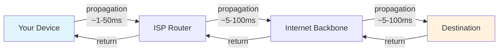
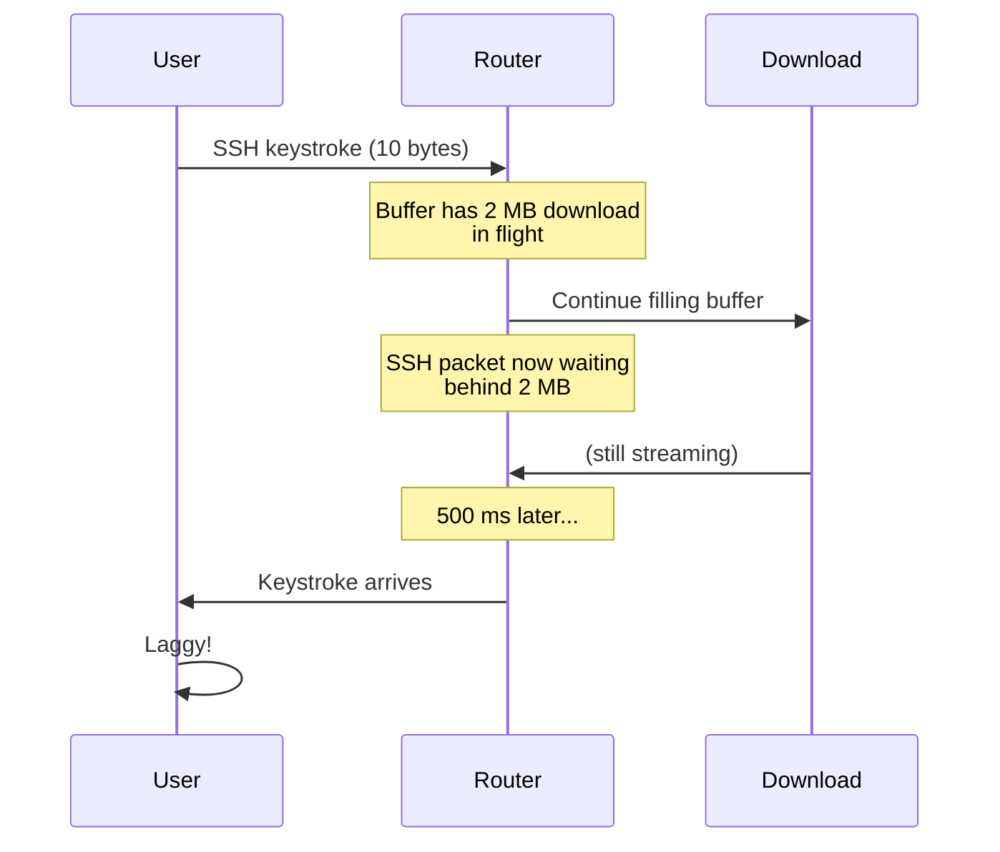
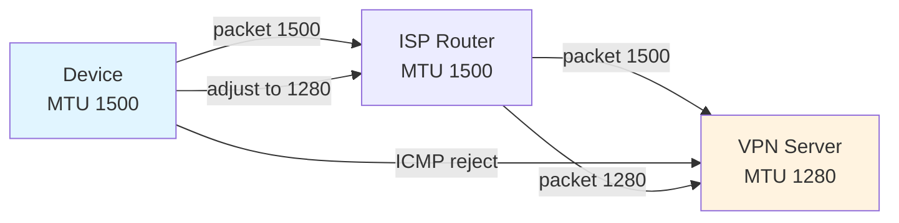

# Network Performance

> Network performance is more than speed. It includes latency (delay), jitter (variation), packet loss, and bufferbloat — each affects different applications in different ways. A fast connection with high jitter is terrible for video calls; a slow connection with zero jitter is fine for downloading files.

## What it is

Network performance describes how well data moves through your network. Unlike "speed" (measured in Mbps), performance captures four critical dimensions:

1. **Latency** — How long a packet takes to travel from source to destination
2. **Jitter** — How much latency varies from packet to packet
3. **Packet Loss** — How many packets fail to reach their destination
4. **Bufferbloat** — Excessive buffering that adds latency when the network is congested

Each metric tells a different story. A speed test measures only throughput (Mbps); it ignores the others entirely.

## Why it matters for your network

Performance issues create user-facing problems that have nothing to do with raw speed:

- **Laggy video calls** — High jitter or latency causes freezing, dropped audio, or awkward delays
- **Online gaming is unplayable** — Even 1% packet loss or 100ms of latency ruins competitive games
- **Web pages feel slow** — High latency means slow initial load; bufferbloat makes it worse under load
- **Streaming video buffers** — Packet loss or latency spikes interrupt playback
- **VoIP drops calls** — Jitter above 30ms degrades audio; above 75ms is unacceptable
- **SSH/VNC is sluggish** — High latency makes remote work miserable

Different applications tolerate performance issues differently. Gaming and VoIP demand low latency and zero loss. File downloads tolerate high latency but need throughput. Video streaming tolerates some latency but needs consistency.

## How it works

### Latency: The Basics

Latency is the round-trip time (RTT) for a packet to travel from your device to a destination and back.

**Where latency comes from:**

1. **Propagation delay** — Speed-of-light limit: data travels ~0.2 meters per nanosecond. A packet to a server 1000 km away takes ~10 ms one way, 20 ms round-trip, no matter how good your network is.
2. **Processing delay** — Each router and switch inspects the packet (microseconds to milliseconds)
3. **Transmission delay** — Time to push all bits onto the wire (milliseconds for large packets on slow links)
4. **Queuing delay** — Waiting in router/switch buffers when the network is congested (milliseconds to seconds)



**Acceptable latencies:**

- **Local network** (<20 ms) — LAN to your router or gateway
- **Internet to nearby ISP gateway** (<30 ms) — Same city or region
- **Cross-country internet** (50–100 ms) — Expected for domestic
- **Transatlantic** (100–150 ms) — Expected for Europe/US
- **Gaming (competitive)** (<50 ms) — Playable, <100 ms acceptable
- **Video call** (<150 ms) — Noticeable delay above 150 ms
- **VoIP** (<150 ms) — ITU-T recommends <150 ms one-way
- **SSH/remote work** (<100 ms) — Comfortable, >300 ms is frustrating

### Jitter: Variation Matters

Jitter is the variation in latency between packets. If 10 pings to a host return: 20ms, 21ms, 19ms, 20ms, 22ms — that's low jitter (1–2 ms variation). If they return: 20ms, 45ms, 18ms, 100ms, 22ms — that's high jitter (82 ms variation).

**Why jitter hurts more than stable high latency:**

- A 100 ms constant latency is fine for video calls (annoying but workable)
- The same path with jitter (20–100 ms varying wildly) causes audio stutter, frozen video, and retransmission timeouts

**How it's measured:**

Jitter = mean absolute difference between consecutive RTTs:

```
RTTs: [20, 45, 18, 100, 22]
Consecutive diffs: [25, 27, 82, 78]
Jitter = (25 + 27 + 82 + 78) / 4 = 53 ms
```

**Percentiles (P95, P99) capture the tail:**

- P95 latency = 95% of packets faster than this value
- P99 latency = 99% of packets faster than this value

A path might have 20 ms average latency but P99 of 150 ms — meaning 1% of packets are very slow, enough to cause buffer underruns in video streaming.

**Acceptable jitter:**

- **VoIP** — <20 ms ideal, <30 ms acceptable, >75 ms unacceptable
- **Video conferencing** — <20 ms ideal, <30 ms acceptable
- **Online gaming** — <10 ms ideal, <50 ms acceptable
- **File transfer** — Jitter doesn't matter much; throughput does

### Packet Loss: When Data Doesn't Arrive

Packet loss occurs when packets fail to reach their destination. It's caused by:

- **Congestion** — Router buffers overflow, packets are dropped
- **Hardware failure** — Faulty NICs, switches, or cables
- **Wireless interference** — WiFi collisions, microwave ovens, weak signal
- **Bit errors** — Corruption in flight; packets are discarded
- **MTU mismatch** — Packet too large, needs fragmentation but DF flag prevents it

**Impact by application:**

- **TCP streams** — Automatically retransmit, causing latency spikes and reduced throughput
- **UDP streams (gaming, VoIP)** — Lost packets become glitches (gap in audio, visual artifacts)
- **Video streaming** — Lost I-frames cause entire scenes to freeze

**Acceptable packet loss:**

- **LAN** — <0.1% (essentially zero)
- **ISP** — <1% typical (0.1–0.5% is good)
- **Wireless** — <2% acceptable, >5% is poor
- **Gaming** — <1% essential; even 0.5% is noticeable

### Bufferbloat: The Hidden Culprit

Bufferbloat is excessive buffering in routers and NICs. When a router has gigabytes of buffer space, it queues packets aggressively instead of dropping them. This sounds good (fewer lost packets) but causes disaster:

1. A user initiates a large download (or upload)
2. Download fills the router's massive buffer
3. All subsequent packets (including latency-sensitive ones like SSH keystrokes or VoIP) queue behind the download
4. Latency skyrockets from 20 ms to 500 ms+ while the download completes
5. The user's video call becomes unusable



**How to detect bufferbloat:**

1. Measure ping latency while network is idle → `idle_latency` (typically 10–20 ms)
2. Start a large download or upload in the background
3. Measure ping latency again while load is active → `loaded_latency`
4. Compare:
   - `loaded_latency < 2 × idle_latency` → No bufferbloat
   - `2–4 × increase` → Mild bufferbloat
   - `>4 × increase` → Severe bufferbloat

**Example:**
- Idle: 20 ms average
- Under load: 200 ms average
- Ratio: 10×
- Verdict: Severe bufferbloat

**Solutions:**

- **Router-level (CoDel, fq_codel, CAKE)** — Modern Linux routers use intelligent queue management (OpenWrt, DD-WRT). These algorithms drop packets early instead of buffering, keeping latency low even under load.
- **NIC queue tuning** — Reduce buffer sizes on your device's network interface
- **Upgrade router firmware** — Modern routers (WiFi 6, WiFi 7) have better queue management
- **ISP responsibility** — Your ISP's edge routers should implement CoDel/CAKE; many don't yet

### MTU and Fragmentation

**MTU (Maximum Transmission Unit)** is the largest packet size that can be sent without fragmentation. Ethernet's standard MTU is 1500 bytes.

**Path MTU Discovery (PMTUD):**

If a packet is too large for a link in the path, routers reject it (ICMP "Fragmentation Needed" message) unless the "Don't Fragment" (DF) flag is set. Modern systems use PMTUD to discover the smallest MTU in the path and adjust packet size accordingly.



**Common MTU values:**

- **Ethernet** — 1500 bytes (standard)
- **IPv6 minimum** — 1280 bytes (if no ND/RA negotiation)
- **PPPoE** (old ISPs) — 1492 bytes
- **VPN** — 1280–1400 bytes (depends on tunnel overhead)
- **Mobile networks** — Often 1400–1500 bytes

**Problems with wrong MTU:**

- **Too small** — Unnecessary fragmentation, overhead, reduced throughput
- **Too large** — Packets are rejected, connection times out or stalls
- **PMTUD blackhole** — Router blocks ICMP reject messages; sender doesn't know MTU is wrong

### Bandwidth vs Throughput

**Bandwidth** = theoretical maximum speed (Mbps or Gbps). It's the pipe's diameter.

**Throughput** = actual speed you achieve. It's the water flowing through the pipe, affected by leaks (packet loss), friction (latency, congestion), and many devices using the same pipe.

A 1 Gbps connection might achieve only 500 Mbps actual throughput if:
- Half the bandwidth is used by your housemate's 4K video stream
- Packet loss causes retransmissions (same data sent multiple times)
- High latency causes TCP congestion window to stall

**Why speed tests are misleading:**

Speed tests measure your device to an optimized server under ideal conditions (TCP with large window size, no loss, no competing traffic). Real-world usage is different:
- Competing traffic on your WiFi
- Latency to distant servers
- Packet loss over cellular
- Limited TCP window on high-latency paths

A 100 Mbps line that scores 80 Mbps on speedtest.net but has 150 ms latency and 2% packet loss will feel slow for video calls and online gaming.

## What netglance checks

See [`tools/perf.md`](../../reference/tools/perf.md) for detailed performance checks:

- **Latency (RTT)** — Average round-trip time to a target
- **Jitter** — Variation in latency between packets
- **P95/P99 latency** — 95th and 99th percentile latencies (tail analysis)
- **Packet loss** — Percentage of packets that don't arrive
- **Path MTU** — Discovery of maximum packet size without fragmentation
- **Bufferbloat detection** — Latency idle vs under load, with severity rating

## Key terms

- **RTT (Round-Trip Time)** — Time for a packet to go from source to destination and back (latency)
- **Latency** — Delay experienced by a single packet or stream
- **Jitter** — Variation in latency between packets or over time
- **P95/P99** — 95th/99th percentile latencies; worst 5%/1% of packets
- **Packet Loss** — Percentage of packets that fail to reach destination
- **Throughput** — Actual data rate achieved (Mbps or Gbps)
- **Bandwidth** — Theoretical maximum speed of a link
- **MTU (Maximum Transmission Unit)** — Largest packet size that can be sent without fragmentation
- **PMTUD (Path MTU Discovery)** — Process of finding the smallest MTU along a network path
- **DF (Don't Fragment)** — IP flag that prevents routers from fragmenting packets
- **Bufferbloat** — Excessive buffering in routers causing latency spikes under load
- **CoDel/fq_codel/CAKE** — Intelligent queue management algorithms that prevent bufferbloat
- **TCP window size** — Amount of unacknowledged data TCP allows; affects throughput on high-latency paths
- **Fragmentation** — Breaking a packet into smaller pieces; adds overhead and complexity
- **Congestion** — Network load exceeding link capacity, causing queuing and packet loss
- **VoIP** — Voice over IP; real-time audio requires low latency and jitter

## Further reading

- [Cloudflare: What is Latency?](https://www.cloudflare.com/learning/performance/glossary/latency/)
- [Bufferbloat.net](https://www.bufferbloat.net/) — Bufferbloat project and testing
- [CoDel Papers](https://www.bufferbloat.net/projects/codel/) — Technical details on queue management
- [IETF RFC 4821 — Path MTU Discovery](https://tools.ietf.org/html/rfc4821)
- [ITU-T Recommendation G.114 — One-way Transmission Delay](https://www.itu.int/rec/T-REC-G.114-200303-I/)
- [TCP Tuning for Satellite Networks](https://www.csail.mit.edu/news/tcp-tuning-high-latency-networks)
- [WiFi Alliance: Understanding Jitter](https://www.wi-fi.org/) (search 802.11 specs)
