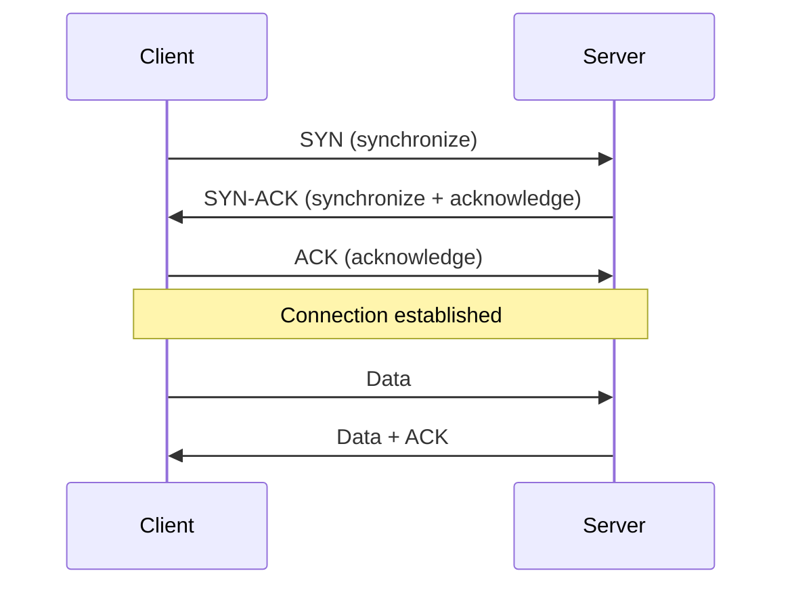
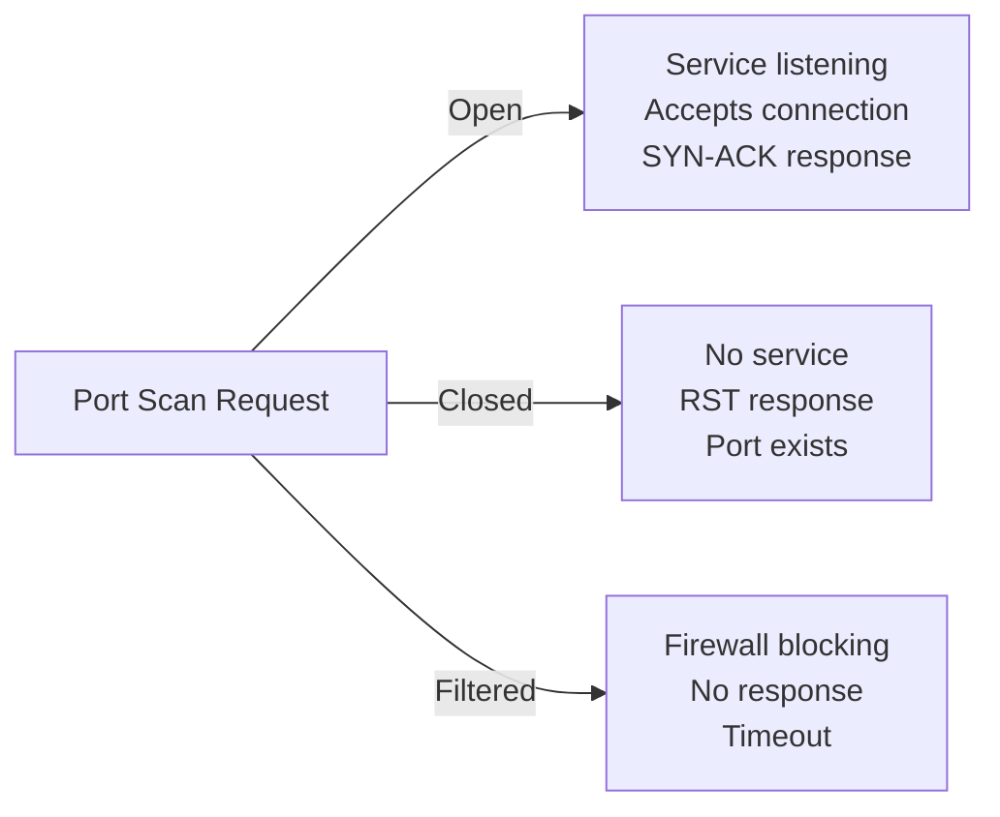

# Ports and Services

> A port is a numbered endpoint on a device where network services listen for incoming connections. Understanding ports is essential for network security and troubleshooting.

## What it is

A **port** is a 16-bit number (0–65535) that identifies a specific endpoint on a network device. Think of your IP address as a building address and ports as individual apartment numbers—the IP gets the packet to your device, and the port number tells the device which service should handle it.

A **service** is the software (a daemon or application) that listens on a port waiting for connections. When you access a website, your browser connects to a service listening on port 80 (HTTP) or 443 (HTTPS) on the server.

**TCP** (Transmission Control Protocol) and **UDP** (User Datagram Protocol) are the two main transport protocols used with ports:

- **TCP** is connection-oriented and reliable. It establishes a connection first (handshake), guarantees packets arrive in order, and detects errors. Used for HTTP, HTTPS, SSH, email, and anything where data integrity matters.
- **UDP** is connectionless and fast. It sends packets without setup or guarantees they arrive in order. Used for DNS queries, streaming video, online gaming, and real-time applications where speed beats reliability.

## Why it matters for your network

Every open port on your network device is a potential attack surface. If a port is open, a service is listening—and that service may have vulnerabilities.

Common risks in home networks:

- **Forgotten services**: An old SSH server or web server left running and exposed to the internet
- **IoT device management ports**: IP cameras, printers, and smart home devices often have management interfaces on non-standard ports
- **UPnP auto-forwarding**: Devices may automatically open ports on your router to enable features, sometimes exposing them to the internet
- **Service vulnerabilities**: Even well-known services (web servers, SSH) need regular patching
- **Banner leakage**: Services often announce their version, telling attackers exactly what software you're running

Regular port audits help you understand what's exposed and why.

## How it works

### TCP: The Three-Way Handshake

TCP establishes a connection before data flows. Here's the sequence:



1. **SYN**: Client sends a synchronization packet to initiate a connection
2. **SYN-ACK**: Server responds, confirming it's ready and sending its own sequence number
3. **ACK**: Client acknowledges the server's response
4. The connection is open and data can flow

### UDP: Fire and Forget

UDP skips the handshake entirely. The client just sends data to a UDP port. The server processes it or ignores it—no acknowledgment required.

### Port States

When you scan a port, you get one of three responses:

- **Open**: A service is actively listening on this port. The server responds to connection attempts.
- **Closed**: No service is listening, but the port exists on the device. The server responds with a RST (reset) packet, essentially saying "no one here."
- **Filtered**: A firewall is blocking traffic to this port. The firewall silently drops packets—no response at all. You don't know if a service is there because the firewall won't let you ask.

Here's how responses differ:



### Well-Known Ports

The Internet Assigned Numbers Authority (IANA) designates ports 0–1023 as "well-known." Here are the ones you're likely to encounter:

| Port | Protocol | Service | Purpose |
|------|----------|---------|---------|
| 21 | TCP | FTP | File transfer (legacy, insecure) |
| 22 | TCP | SSH | Secure shell / remote login |
| 23 | TCP | Telnet | Remote login (insecure, obsolete) |
| 25 | TCP | SMTP | Email submission |
| 53 | TCP/UDP | DNS | Domain name resolution |
| 80 | TCP | HTTP | Web traffic (unencrypted) |
| 110 | TCP | POP3 | Email retrieval |
| 143 | TCP | IMAP | Email retrieval |
| 443 | TCP | HTTPS | Web traffic (encrypted) |
| 1900 | UDP | SSDP/UPnP | Device discovery & control |
| 3389 | TCP | RDP | Remote desktop (Windows) |
| 5353 | UDP | mDNS | Local network discovery |
| 8080 | TCP | HTTP Alt | Web proxy, alternative HTTP |

Ports 1024–49151 are "registered" (assigned to specific services by IANA but not system-protected). Ports 49152–65535 are "ephemeral" or "dynamic" (used by clients for temporary connections).

### Service Fingerprinting

When you connect to a service, it often announces itself via a "banner"—a text message identifying the software and version. For example:

```
SSH-2.0-OpenSSH_8.6p1 Ubuntu 3ubuntu0.1
```

This tells you the exact SSH version. Attackers use this information to target known vulnerabilities. Responsible administrators either hide banners or keep software patched.

## What netglance checks

- **[`tools/scan.md`](../../reference/tools/scan.md)** — Port scanning to identify open, closed, and filtered ports. Service detection via banner grabbing. Identifies well-known services and unusual ports.
- **[`tools/firewall.md`](../../reference/tools/firewall.md)** — Firewall rule analysis. Identifies which ports are open intentionally vs. exposed by misconfiguration.

Run `netglance scan` to audit your local device or network for unexpected open ports. Check `netglance firewall` to understand your device's packet filtering rules.

## Key terms

- **TCP (Transmission Control Protocol)**: Connection-oriented, reliable transport protocol. Guarantees in-order delivery and error detection.
- **UDP (User Datagram Protocol)**: Connectionless, fast transport protocol. No connection setup; best-effort delivery.
- **Port**: A 16-bit number (0–65535) identifying a service endpoint on a device.
- **Socket**: The combination of an IP address, port, and protocol (e.g., `192.168.1.1:22/TCP`). The full address for a network conversation.
- **Well-known port**: A port in the range 0–1023, assigned by IANA for standard services (SSH, DNS, HTTP, etc.).
- **Ephemeral port**: A temporary port assigned by the OS to a client connection, typically in the range 49152–65535.
- **Service / Daemon**: Software listening on a port waiting for connections (e.g., sshd, httpd, named).
- **Listening**: A service actively waiting for incoming connections on a specific port.
- **Open port**: A port where a service is actively accepting connections.
- **Closed port**: A port where no service is listening, but the device responds to indicate the port exists.
- **Filtered port**: A port where a firewall silently drops packets, preventing any determination of state.
- **SYN**: Synchronize packet; the first step in a TCP handshake.
- **ACK**: Acknowledge packet; confirms receipt or readiness in TCP.
- **Three-way handshake**: The SYN → SYN-ACK → ACK sequence that establishes a TCP connection.
- **Banner**: Text announcement sent by a service identifying its software and version (e.g., "OpenSSH_8.6").
- **Service fingerprint**: The combination of port, protocol, and banner identifying what software is running.
- **Attack surface**: The set of open ports and services exposed to potential attackers.

## Further reading

- [IANA Port Numbers Registry](https://www.iana.org/assignments/service-names-port-numbers/)
- [TCP/IP Fundamentals](https://tools.ietf.org/html/rfc793) (RFC 793)
- [UDP Protocol](https://tools.ietf.org/html/rfc768) (RFC 768)
- [Nmap Official Guide to Scanning](https://nmap.org/book/man-port-scanning-basics.html)
