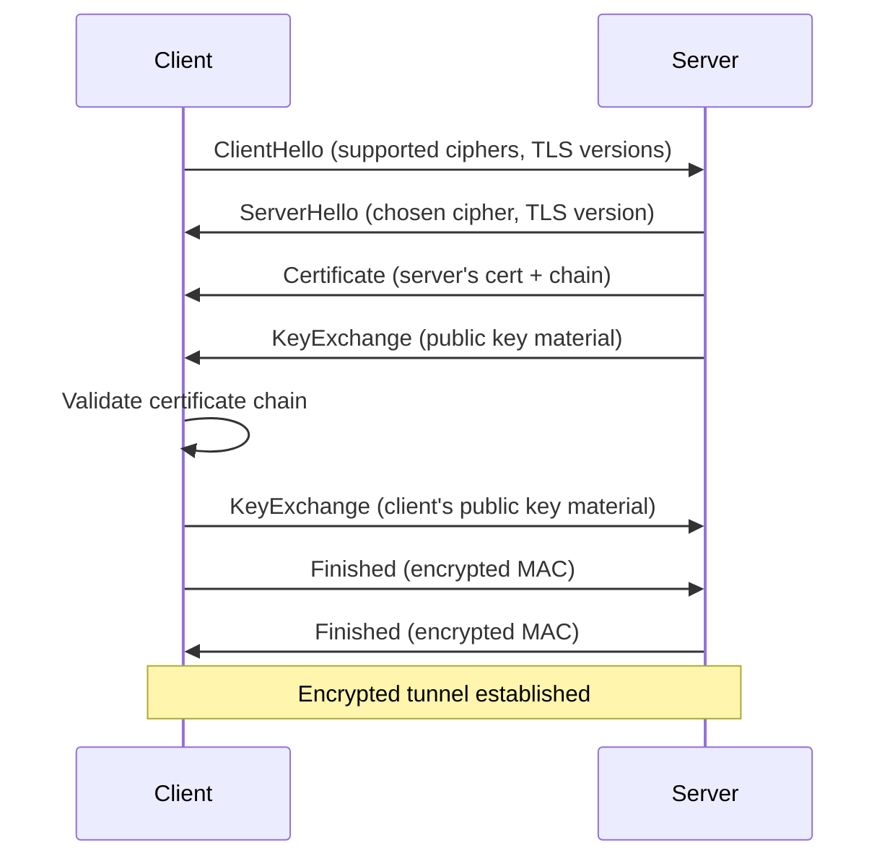

# TLS and Certificates

> Encrypted connections to websites rely on a chain of cryptographic proof that you're talking to the real server—and not an attacker. Understanding how that works helps you spot problems.

## What it is

TLS (Transport Layer Security) is the protocol that encrypts your connection to websites and other internet services. It uses **certificates**—digital documents signed by trusted authorities (CAs)—to prove that the server you're connecting to is really who it claims to be. Without this proof, an attacker on your network could intercept your connection and read (or modify) everything you send.

## Why it matters for your network

A broken TLS setup is a security and reliability problem:

- **Expired certificates** cause HTTPS connections to fail entirely, breaking websites and APIs.
- **Invalid certificate chains** (missing intermediates, broken signatures) prevent secure connections and trigger browser warnings.
- **Cipher suite weaknesses** (outdated protocols like TLS 1.0) expose encrypted traffic to known attacks.
- **MITM interception** (corporate proxies, malware, unauthorized network proxies) can present fake certificates to intercept your traffic. Detecting this is critical.
- **Misconfigured HTTPS redirects** can expose plain-text cookies or credentials before switching to HTTPS.

netglance checks all of these to help you ensure encrypted connections are genuine.

## How it works

### The TLS Handshake

When your browser connects to an HTTPS website, a **handshake** establishes the encrypted channel:



**Key steps:**
1. **Client Hello**: Client offers supported TLS versions and cipher suites.
2. **Server Hello + Certificate**: Server picks a cipher suite, sends its certificate chain, and begins key exchange.
3. **Certificate Validation**: Client verifies the certificate chain (see below) and that it matches the domain.
4. **Key Exchange**: Both sides compute a shared secret without ever sending it over the network.
5. **Finished**: Both sides send authenticated handshake summaries to confirm no tampering.

**TLS 1.2 vs 1.3**: TLS 1.3 (2018) removed weak ciphers and reduced the handshake from two round trips to one, making it faster and more secure. Older sites still use TLS 1.2, which is acceptable but slower.

### Certificate Chains and Trust

A certificate is a digitally signed document claiming "I am example.com." But how do you know the signer wasn't lying?

**Answer: certificate chains.**

Your browser has a pre-installed list of ~100 **root CAs** (Certificate Authorities) it trusts: DigiCert, Let's Encrypt, GlobalSign, etc. A website's certificate works like this:

```
example.com's certificate (signed by Intermediate CA)
    ↑ verified by signature
Intermediate CA's certificate (signed by Root CA)
    ↑ verified by signature
Root CA's certificate (pre-installed in your OS/browser)
    ↑ trust ends here — you decided to trust this CA
```

The server must send the complete chain. If any link is missing or forged, the chain breaks and the connection is untrusted.

**What can go wrong:**
- Intermediate certificate is missing → chain is incomplete, connection fails.
- Certificate is self-signed (not signed by a trusted CA) → connection is untrusted.
- Certificate is signed by an untrusted or revoked CA → connection is untrusted.
- Server sends only its own certificate, not the intermediates → chain breaks.

### Certificate Fields (X.509)

An X.509 certificate is a standardized format containing:

| Field | Meaning |
|-------|---------|
| **Subject CN** | Common Name — the primary domain (e.g., `example.com`) |
| **Subject Alternative Names (SAN)** | Additional domains covered (e.g., `*.example.com`, `sub.example.com`). Modern certificates use SAN; older ones relied only on CN. |
| **Issuer** | The CA that signed this certificate. |
| **Validity (Not Before / Not After)** | Start and end dates. Expired certificates are untrusted and cause connection failures. |
| **Serial Number** | Unique identifier for this cert (used in revocation checks). |
| **Signature Algorithm** | How the issuer signed this cert (e.g., SHA-256 RSA). Weak algorithms (MD5, SHA-1) are deprecated. |
| **Public Key** | Used by clients to verify the server's identity and set up encryption. |

**Common issues:**
- **Expiry**: Certificates expire (typically 1–2 years). If you forget to renew, the service goes down.
- **Hostname mismatch**: Certificate is for `api.example.com`, but you're connecting to `api2.example.com` → mismatch, untrusted.
- **Wildcard scope**: `*.example.com` covers subdomains but NOT `example.com` itself (unless the SAN includes both).

## What netglance checks

- **[`tools/tls.md`](../../reference/tools/tls.md)**
  - Certificate chain completeness and validity
  - Expiry warnings and revoked certificates
  - Cipher suite strength and TLS version audit
  - Protocol version checks (TLS 1.2+, reject TLS 1.0/1.1)
  - Self-signed and weak-signature detection

- **[`tools/http.md`](../../reference/tools/http.md)**
  - HTTPS redirect verification (ensure HTTP→HTTPS is enforced)
  - HSTS header presence (ensures browsers always use HTTPS)
  - Proxy interception detection (unexpected certificate issuers, non-standard CAs)
  - Certificate pinning violations (if your app expects specific certs)

## Key terms

**TLS (Transport Layer Security)**
The modern standard for encrypting internet connections. Replaced the deprecated SSL 3.0.

**SSL (Secure Sockets Layer)**
Deprecated predecessor to TLS. Versions 2.0 and 3.0 are broken. Don't use them.

**Certificate**
A digitally signed document binding a public key to a domain name and validity period.

**X.509**
The standard format for digital certificates used on the internet.

**CA (Certificate Authority)**
An organization trusted to issue and verify certificates.

**Root CA**
The top-level CA in a chain. Pre-installed in your OS/browser. Examples: Let's Encrypt, DigiCert, GlobalSign.

**Intermediate CA**
A CA that bridges the root CA and the end-entity certificate. Allows root CAs to issue certs indirectly.

**Certificate Chain**
The sequence of certificates from the server's certificate up to a trusted root CA. Must be complete and valid.

**Chain of Trust**
The logical path of cryptographic verification from a server's certificate back to a root CA your system trusts.

**Cipher Suite**
A set of algorithms for encryption, key exchange, and hashing. Examples: `TLS_AES_256_GCM_SHA384` (TLS 1.3), `TLS_RSA_WITH_AES_128_CBC_SHA` (TLS 1.2, now weak).

**Key Exchange**
The process of two parties deriving a shared secret without transmitting it. Modern methods: ECDHE (elliptic curve, forward-secure), RSA (older, less secure).

**Handshake**
The multi-step negotiation between client and server to establish a TLS connection.

**CN (Common Name)**
The primary domain name in a certificate's Subject field. Largely superseded by SAN.

**SAN (Subject Alternative Names)**
Additional domains covered by a certificate. Modern best practice.

**Expiry**
The date after which a certificate is no longer trusted. Expired certs cause connection failures.

**Revocation**
Invalidating a certificate before expiry (e.g., if the private key is compromised). Checked via CRL or OCSP.

**CRL (Certificate Revocation List)**
A file of revoked certificate serial numbers, issued by a CA. Clients fetch and check it.

**OCSP (Online Certificate Status Protocol)**
A lightweight alternative to CRL. Client queries a server: "Is this certificate revoked?"

**Certificate Pinning**
Hardcoding a certificate (or CA) in an app so it only accepts that cert/CA for a specific domain. Prevents MITM even if a CA is compromised.

**Certificate Transparency (CT)**
A public, append-only log of all issued certificates. Helps detect mis-issued or malicious certificates. All modern certificates include CT timestamps (SCTs).

**SCT (Signed Certificate Timestamp)**
A proof that a certificate was logged in a Certificate Transparency log.

**HSTS (HTTP Strict-Transport-Security)**
An HTTP header that tells browsers "always use HTTPS for this domain." Prevents downgrade attacks.

**MITM (Man-in-the-Middle)**
An attacker positioned between you and a server, intercepting and modifying traffic. TLS + certificate validation defeats MITM (unless the attacker controls a trusted CA).

## Further reading

- [Let's Encrypt - How It Works](https://letsencrypt.org/how-it-works/) — Simple overview of certificate issuance.
- [Mozilla SSL Configuration Generator](https://ssl-config.mozilla.org/) — Generate secure TLS configs for servers.
- [OWASP - Certificate and Public Key Pinning](https://owasp.org/www-community/Pinning_Cheat_Sheet) — Pinning strategies.
- [Certificate Transparency](https://certificate.transparency.dev/) — Public logs of issued certificates.
- [RFC 5280 - X.509](https://tools.ietf.org/html/rfc5280) — The X.509 certificate specification (deep dive).
- [TLS 1.3 (RFC 8446)](https://tools.ietf.org/html/rfc8446) — Modern TLS protocol spec.
