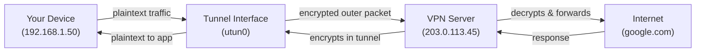

# VPN Fundamentals

> A VPN creates an encrypted tunnel that routes your traffic through a remote server, hiding your activity from your ISP and protecting you on untrusted networks. But VPNs can leak — DNS queries, IPv6 traffic, or kill switch failures can expose your real identity.

## What it is

A VPN (Virtual Private Network) is a service that encrypts all (or most) of your internet traffic and routes it through a remote server operated by the VPN provider. Instead of your ISP seeing your web requests, the VPN server does. To external websites, it looks like the traffic is coming from the VPN server's IP, not your own.

The core idea: your device creates a "tunnel" to the VPN server. Your traffic enters the tunnel encrypted, travels safely through the internet, exits from the VPN server, and returns the same way.

## Why it matters for your network

VPNs solve real privacy and security problems, but they introduce new ones:

**Benefits:**
- **Privacy from your ISP** — Your ISP can no longer see which websites you visit (though they can see that you're using a VPN).
- **Security on untrusted networks** — Coffee shop WiFi, airport networks, and hotel networks can be snooped. A VPN encrypts your traffic so attackers on the same network can't intercept passwords or data.
- **Bypass geo-restrictions** — Websites that check your IP address think you're in the VPN server's country.
- **Hide your real IP** — Websites see the VPN server's IP, not yours.

**Risks:**
- **DNS leaks** — DNS queries reveal which websites you're trying to visit, even if the rest of your traffic is encrypted.
- **IPv6 leaks** — IPv6 traffic can bypass an IPv4-only VPN tunnel entirely.
- **Kill switch failures** — If the VPN connection drops, traffic may flow unencrypted before you realize.
- **Split tunnel weakness** — Some traffic may bypass the VPN and leak your real IP.
- **Trust the VPN provider** — You've moved trust from your ISP to the VPN company. They can see your traffic if they log it.

## How VPN tunneling works

### The Tunnel Concept

When you connect to a VPN, your device creates a special tunnel interface (on macOS called `utun`, on Linux called `tun`, with WireGuard it's `wg0`, etc). All your traffic goes into this tunnel, gets encrypted, and emerges from the VPN server.

The tunnel works through **encapsulation**: your original packet (source: your real IP, destination: google.com) is wrapped inside an encrypted outer packet (source: your device, destination: VPN server). Only the VPN server can decrypt and unwrap the inner packet.

### Full Tunnel vs Split Tunnel

**Full Tunnel** (default on most VPNs):
- All traffic from all apps goes through the tunnel
- Every website, DNS query, and connection uses the VPN
- Slowest but safest — nothing leaks

**Split Tunnel**:
- You choose which apps or destinations use the VPN
- Other traffic goes directly to the internet
- Faster for local traffic (LAN, print servers) but riskier — misconfiguration is easy
- Example: you might VPN-tunnel web traffic but let local file sharing bypass the tunnel

## Common VPN Protocols

Different VPN services use different encryption protocols. netglance doesn't care which one you're using — it just detects the tunnel interface and checks for leaks.

**WireGuard**
- Modern, minimal codebase (~4000 lines)
- Fast, low overhead
- Supported by most major VPN providers now (ProtonVPN, Mullvad, etc)
- Uses Curve25519 + ChaCha20 encryption

**OpenVPN**
- Mature, widely trusted (been around since 2001)
- Very flexible — supports TCP and UDP, works on constrained networks
- Slower than WireGuard (larger overhead)
- Source is public and widely audited

**IPSec/IKEv2**
- Native support on macOS, Windows, iOS, Android
- Corporate VPNs and enterprise use this
- More complex to set up than WireGuard or OpenVPN
- Kernel-level implementation on most OSes

**Other protocols**: L2TP/IPSec, PPTP (deprecated), SSTP. Varies by provider.

## VPN Leaks: The Core Concern

A VPN is only useful if it actually protects all your traffic. Leaks are the biggest threat — they can expose your activity or real IP even when you think you're protected.

### DNS Leaks

**The problem:** DNS queries are unencrypted by default. When you type `github.com` into your browser, your device sends an unencrypted query to a DNS resolver asking "what's the IP for github.com?" If you're using a VPN but your DNS resolver is not inside the VPN tunnel, your ISP sees the query in plaintext.

**How it happens:**
1. You connect to a VPN
2. Your device's DNS settings point to your ISP's resolver (8.8.8.8, 1.1.1.1, or your ISP's servers)
3. DNS queries slip out unencrypted
4. Your ISP logs every domain you visit

**Detection:** netglance's DNS leak check resolves a test hostname and compares the resolver IPs against known-good IPs (Google DNS, Cloudflare). If unexpected resolvers answer, you've leaked.

### IPv6 Leaks

**The problem:** Many home networks have both IPv4 and IPv6 addresses. If your VPN only encrypts IPv4 traffic, IPv6 queries bypass the tunnel entirely.

**How it happens:**
1. You connect to a VPN (IPv4 tunnel)
2. Your device has both IPv4 (192.168.1.50) and IPv6 (fe80::...) addresses
3. A dual-stack website connects via IPv6
4. IPv6 traffic bypasses the tunnel completely

**Detection:** netglance checks if your device has global (non-link-local) IPv6 addresses while a VPN is active. If both are true, IPv6 may leak.

### Kill Switch Failures

**The problem:** If your VPN connection drops unexpectedly, traffic may resume flowing unencrypted unless a "kill switch" is configured.

**How it works:** A kill switch is a firewall rule that blocks all internet traffic except through the VPN interface. If the VPN disconnects, the internet becomes unreachable until you reconnect.

**Netglance doesn't test this directly** — it requires intentionally dropping the VPN, which is destructive. But most modern VPN clients have kill switches, and you should enable it.

### Split Tunnel Misconfiguration

If split tunneling is enabled but configured wrong, traffic you expected to VPN-tunnel might leak to the internet directly.

**Detection:** netglance probes multiple external IPs (1.1.1.1, 8.8.8.8) and checks if they have different first-hop routers. Different first hops mean split tunneling — some traffic routes through the ISP, some through the VPN.

## What netglance checks

The `netglance vpn` command runs four checks:

1. **VPN Interface Detection**
   - Scans active network interfaces for VPN tunnel names (utun, tun, wg, ppp, proton0, nordlynx)
   - Returns: active VPN interface or "none"

2. **DNS Leak Check**
   - Resolves `dns.google.com` via your system resolver
   - Compares result against known Google DNS IPs
   - Any resolver outside Google's set is flagged as a leak
   - Returns: leaked resolver IPs if any

3. **IPv6 Leak Check**
   - Scans all network interfaces for global (non-link-local) IPv6 addresses
   - If a VPN is active but IPv6 addresses are present, flags as leak
   - Returns: exposed IPv6 addresses if any

4. **Split Tunnel Detection**
   - Sends UDP probes (TTL=1) to 1.1.1.1 and 8.8.8.8
   - Records the first-hop router for each
   - Different first hops = split tunneling
   - Returns: true if split tunneling detected

## Key terms

- **VPN** — Virtual Private Network; encrypts and routes traffic through a remote server
- **Tunnel Interface** — Special network interface (utun, tun, wg) that handles encrypted traffic
- **Encapsulation** — Wrapping an inner packet inside an encrypted outer packet
- **Full Tunnel** — All traffic goes through the VPN
- **Split Tunnel** — Only some traffic (by app or destination) goes through the VPN
- **DNS Leak** — DNS queries bypassing the VPN and revealing visited domains to your ISP
- **IPv6 Leak** — IPv6 traffic routing outside the VPN tunnel when IPv4 is protected
- **Kill Switch** — Firewall rule that blocks all internet if VPN disconnects
- **WireGuard** — Modern VPN protocol; fast and minimal codebase
- **OpenVPN** — Mature VPN protocol; widely trusted and flexible
- **IPSec/IKEv2** — Corporate VPN protocol; native OS support
- **Tunnel Endpoint** — The VPN server's IP address
- **Recursive Resolver** — DNS server that answers queries; should be inside VPN tunnel

## Further reading

- [tools/vpn.md](../../reference/tools/vpn.md) — netglance's VPN leak detection tool
- [concepts/dns-explained.md](dns-explained.md) — Deep dive on DNS leaks and how DNS works
- [WireGuard Whitepaper](https://www.wireguard.com/papers/wireguard.pdf)
- [OpenVPN: How it works](https://openvpn.net/how-openvpn-works/)
- [OWASP: VPN Weaknesses](https://owasp.org/www-community/controls/VPN)
- [Mullvad: VPN Leaks](https://mullvad.net/en/help/double-vpn-leaks)
