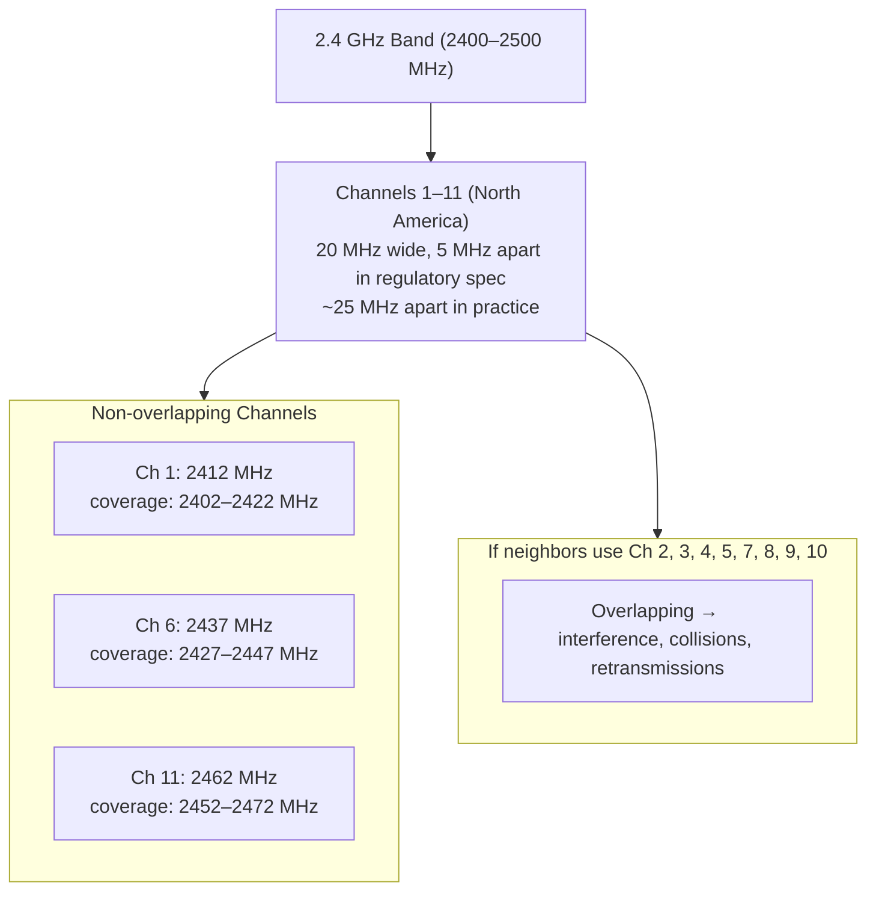

# WiFi Security

> Understanding WiFi protocols, encryption, and threats to detect and prevent attacks on your home network.

## What it is

WiFi security encompasses the protocols, encryption standards, and practices that protect wireless network access and traffic. The main security protocol for home networks is WPA2 or WPA3, which authenticates devices and encrypts data. However, WiFi networks face unique threats—rogue access points, weak encryption on older devices, channel congestion, and eavesdropping—that don't exist on wired networks.

## Why it matters for your network

An open or poorly secured WiFi network allows unauthorized devices to join, intercept unencrypted traffic, launch man-in-the-middle (MITM) attacks, or create "evil twin" networks that trick devices into connecting. Even on an encrypted network, older security standards (WEP, WPA1) are cryptographically broken and offer no real protection. Weak passwords on WPA2 networks can be cracked offline in minutes using leaked PCAP files. Additionally, channel congestion from nearby networks causes slowdowns, and rogue access points can impersonate your network to steal credentials.

## How it works

### WiFi Standards (802.11a/b/g/n/ac/ax/be)

WiFi standards determine speed and spectrum efficiency:

| Standard | Band(s) | Max Speed | Year | Typical Home |
|----------|---------|-----------|------|--------------|
| 802.11b | 2.4 GHz | 11 Mbps | 1999 | Obsolete |
| 802.11g | 2.4 GHz | 54 Mbps | 2003 | Obsolete |
| 802.11n (WiFi 4) | 2.4/5 GHz | 600 Mbps | 2009 | Common legacy |
| 802.11ac (WiFi 5) | 5 GHz | 3.5 Gbps | 2013 | **Most home networks** |
| 802.11ax (WiFi 6) | 2.4/5/6 GHz | 9.6 Gbps | 2019 | **New standard** |
| 802.11be (WiFi 7) | 2.4/5/6 GHz | 46 Gbps | 2024 | Emerging |

Newer standards offer wider channels (80/160/320 MHz), more efficient modulation, and less congestion. However, **speed depends on implementation**—an old 5 GHz router may deliver less throughput than a newer 2.4 GHz mesh system.

### WPA2 vs WPA3

**WPA2 (2004)** is the industry standard and is secure *if implemented correctly*:
- Uses **AES-CCMP** encryption (AES-128 in counter/CBC-MAC mode).
- **PSK (Pre-Shared Key)** mode: A passphrase is hashed once at setup, then used to derive per-client keys. Weak passwords are vulnerable to offline dictionary attacks (capture PCAP, brute-force locally).
- **Enterprise** mode: Uses RADIUS server for 802.1X authentication, per-user credentials, and per-session key derivation. Suitable for large networks.

**WPA3 (2018)** improves on WPA2:
- **SAE (Simultaneous Authentication of Equals)** replaces PSK: A cryptographic handshake that defeats offline dictionary attacks even with weak passwords. Derived keys are tied to the handshake, not the passphrase alone.
- **Forward secrecy**: Even if the PSK is compromised, traffic encrypted before compromise remains secret.
- **Protection against brute-force**: SAE limits handshake attempts.
- **Protection on open networks**: Opportunistic Wireless Encryption (OWE) encrypts traffic without authentication.

**Adoption is slow** because older devices (phones, IoT, laptops from 2019–2021) don't support WPA3. Many routers default to **WPA2/WPA3 mixed mode**, but this weakens security to WPA2 levels if *any* client uses WPA2.

**Avoid WEP and WPA1**—both are cryptographically broken. WEP can be cracked in minutes; WPA1 has known key recovery attacks.

### Channels and Bands

**2.4 GHz band:**
- 11–14 channels worldwide (only 1–11 in North America, 1–13 in EU, 1–14 in Japan).
- **Only 3 are non-overlapping: 1, 6, 11** (each is 20 MHz wide, spaced 25 MHz apart).
- Longer range and better wall penetration than 5 GHz.
- **Higher congestion**: Every IoT device, microwave, baby monitor, and neighbor's router shares this band.
- Used by older and low-power devices.

**5 GHz band:**
- Many more non-overlapping channels (36–165, subdivided into regional groups).
- Includes **DFS channels** (120–165) shared with weather radar; routers must detect and vacate radar pulses.
- Shorter range (attenuates ~6 dB more than 2.4 GHz over distance) but less congestion.
- Faster speeds and wider channels (20/40/80/160 MHz).
- Preferred for laptops and desktops.

**6 GHz band (WiFi 6E/7):**
- New spectrum exclusively for WiFi (in some regions).
- Even more channels, minimal congestion initially.
- Requires WPA3 or WPA3-capable hardware.
- Still rare in consumer devices.

**Channel width (bandwidth):**
- 20 MHz: Slower but less interference, good for congested areas.
- 40/80/160 MHz: Faster but wider "collision domain"—affects more neighbors.
- **Tradeoff**: Wider is faster but increases interference vulnerability.

### Signal Strength (dBm and RSSI)

WiFi signal strength is measured in **dBm (decibels relative to 1 milliwatt)**—a logarithmic scale where 0 dBm is 1 mW and each 10 dB drop is a 10× power reduction.

| dBm | Interpretation | Use Case |
|-----|---|---|
| -30 to -40 | Excellent | Very close to AP, near-optimal |
| -40 to -67 | Good | Typical home coverage, fast reliable speeds |
| -67 to -70 | Fair | Marginal but usable; web browsing, email OK |
| -70 to -80 | Weak | Unstable, frequent disconnects, slow |
| < -80 | Very weak | Unusable; unlikely to associate |

**RSSI (Received Signal Strength Indicator)** is the raw measured signal at the client; it fluctuates with interference and movement. **Path loss** increases with distance and obstacles (drywall ~4 dB, brick ~10 dB, metal ~15+ dB per wall).

**Signal strength is not speed**—a strong signal on a congested channel may deliver worse throughput than a weaker signal on a clear channel.

### Evil Twin Attacks

An attacker sets up a rogue access point with the same SSID as a legitimate network (e.g., "HomeNetwork" or "Starbucks_WiFi"). Devices may auto-connect if they've previously connected to that SSID. Once connected, the attacker can:
- Intercept unencrypted HTTP traffic and inject malware.
- Perform MITM attacks on HTTPS (with additional techniques like SSL stripping).
- Steal login credentials.
- Redirect to phishing pages.

**Detection:**
- Monitor for multiple **BSSIDs** (MAC addresses) broadcasting the same SSID—legitimate mesh networks have predictable BSSIDs; rogue APs often appear randomly.
- Check signal strength; a "stray" SSID appearing at unusual locations suggests a rogue AP.
- netglance can scan for and alert on duplicate SSIDs.

### Channel Congestion

In a typical apartment building, dozens of routers broadcast on the same few non-overlapping 2.4 GHz channels (1, 6, 11). The more networks sharing a channel, the more collisions, retransmissions, and latency—even if signal strength is good. **Congestion causes:**
- Increased latency and timeouts.
- Lower throughput (shared airtime).
- More frequent disconnections.

**Resolution:** Switch to a less-congested channel (requires a WiFi analyzer to scan neighbors) or migrate to 5/6 GHz bands where more channels are available.

### BSSID vs SSID

- **SSID** (Service Set IDentifier): The human-readable network name you see when scanning ("MyWiFi").
- **BSSID** (Basic Service Set Identifier): The **MAC address of the AP radio** (e.g., `aa:bb:cc:dd:ee:ff`).
- A single SSID can have multiple BSSIDs if you have a mesh network with multiple APs, a dual-band router (separate 2.4 GHz and 5 GHz radios), or tri-band routers.

netglance tracks both because security threats (evil twins, rogue APs) are identified by BSSID. Multiple BSSIDs for the same SSID is normal in a mesh; a stray BSSID is suspicious.

### Channel Overlap Diagram

## What netglance checks

The **[`wifi.md`](../../reference/tools/wifi.md)** tool performs:
- **Channel analysis**: Identifies congested channels and recommends less-congested alternatives.
- **Signal strength monitoring**: Plots RSSI over time and detects weak coverage zones.
- **Security protocol detection**: Reports WPA2, WPA3, open networks, and WEP/WPA1 (broken protocols).
- **Evil twin detection**: Scans for multiple BSSIDs per SSID and alerts on suspicious access points.
- **Rogue AP alerts**: Detects access points with spoofed or unusual characteristics (e.g., high transmit power, unexpected locations).
- **Band utilization**: Shows 2.4 GHz, 5 GHz, and 6 GHz usage; recommends band steering.

## Key terms

- **802.11**: The IEEE standard family for wireless local area networks (WLAN).
- **Access Point (AP)**: A radio device that broadcasts a WiFi network. Most home routers include an AP.
- **Band**: A frequency range. 2.4 GHz, 5 GHz, and 6 GHz are three separate bands, each with different characteristics and regulations.
- **Beacon**: A periodic broadcast frame from an AP announcing its SSID, supported standards, and security settings.
- **BSSID**: The MAC address (hardware address) of a specific AP radio.
- **Channel**: A narrow frequency subdivision within a band. 2.4 GHz has 11–14 channels; 5 GHz has ~30+ non-overlapping channels.
- **Channel width (bandwidth)**: The frequency span of a channel. Wider channels (40/80/160 MHz) deliver higher speeds but risk more interference.
- **Deauthentication (deauth)**: A WiFi frame that disconnects a client from an AP. Can be spoofed to perform denial-of-service attacks.
- **DFS (Dynamic Frequency Selection)**: A regulatory mechanism that dynamically avoids radar interference on 5 GHz DFS channels (120–165).
- **Evil twin**: A rogue access point with the same SSID as a legitimate network, used to deceive and intercept traffic from devices.
- **Mesh network**: Multiple APs (often with the same SSID and different BSSIDs) that relay traffic and provide seamless roaming.
- **Open network**: A WiFi network with no encryption (no WPA2/WPA3). Any device can join; traffic is unencrypted and vulnerable.
- **Probe request**: A frame sent by a client seeking networks with a specific SSID (active scanning).
- **PSK (Pre-Shared Key)**: WPA2/WPA3 authentication mode using a shared passphrase for all clients.
- **RSSI (Received Signal Strength Indicator)**: The measured power of the WiFi signal at the client, in dBm.
- **Rogue AP**: An unauthorized or malicious access point, often impersonating a legitimate network.
- **SAE (Simultaneous Authentication of Equals)**: WPA3's key exchange protocol, resistant to offline dictionary attacks and offering forward secrecy.
- **SSID**: The human-readable name of a WiFi network.
- **WEP (Wired Equivalent Privacy)**: An obsolete and broken WiFi encryption standard; do not use.
- **WPA1 (WiFi Protected Access)**: An early encryption standard with known vulnerabilities; do not use.
- **WPA2 (WiFi Protected Access 2)**: The current industry-standard encryption protocol; secure if implemented correctly.
- **WPA3 (WiFi Protected Access 3)**: The newest encryption protocol with improvements to key exchange (SAE), forward secrecy, and brute-force resistance.

## Further reading

- [WiFi Alliance – WPA3 Overview](https://www.wi-fi.org/security/wpa3) — Official WPA3 specification and benefits.
- [IEEE 802.11 Standards](https://en.wikipedia.org/wiki/IEEE_802.11) — Complete overview of WiFi generations and standards.
- [NIST SP 800-153 – Guidelines for Securing Wireless Local Area Networks (WLANs)](https://csrc.nist.gov/publications/detail/sp/800-153/final) — Security best practices.
- [WiFi Channel Frequency Chart](https://www.metageek.com/training/resources/wifi-channel-chart.html) — Visual guide to channel allocation and overlap.
- [Evil Twin Detection](https://en.wikipedia.org/wiki/Evil_twin_(wireless_networks)) — Attack methodology and detection strategies.
