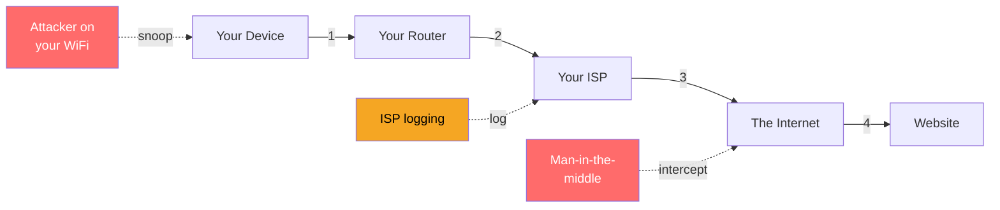
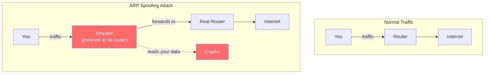
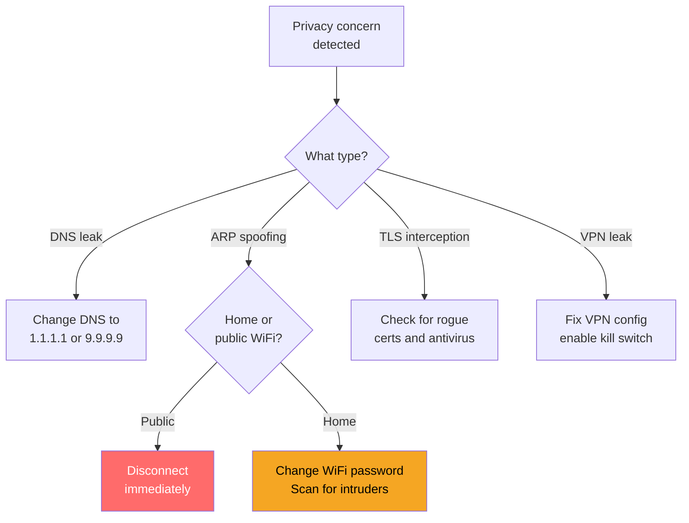

# Am I Being Watched?

> Whether you're worried about hackers on public WiFi, an ISP snooping on your browsing, or just want to verify your VPN is actually working — this guide walks you through a complete privacy check on your network connection.

<!-- TODO: Hero image — generate with prompt: "Illustration of a person at a laptop with a transparent shield around them, showing intercepted data packets being blocked, while some red packets slip through cracks, minimal security theme, dark blue background" -->

## What "being watched" actually means

When you browse the web, your data passes through several points before reaching its destination. At each point, someone could potentially see or modify your traffic:



The four main risks:

1. **Someone on your local network** intercepting traffic (ARP spoofing)
2. **Your DNS requests leaking** — revealing which websites you visit
3. **TLS interception** — someone pretending to be the website you're connecting to
4. **VPN leaks** — your VPN says it's protecting you, but traffic is slipping around it

Let's check each one.

## Step 1: Check your DNS

DNS is like a phone book — every time you visit a website, your device looks up its address. If someone controls your DNS, they can see every site you visit, redirect you to fake sites, or block access entirely.

```bash
netglance dns
```

```
DNS Health Check
──────────────────────────────────────────────────
Resolver:        192.168.1.1 (your router)
Upstream:        ISP default
DNSSEC:          not enabled
Leak test:       PASS — queries go to expected server
Hijack test:     PASS — no redirection detected
Response time:   12 ms
```

**What to look for:**

| Check | Good | Concerning |
|-------|------|-----------|
| Resolver | Known provider (Cloudflare, Google, Quad9) | "ISP default" or unknown |
| DNSSEC | Enabled | Not enabled |
| Leak test | PASS | FAIL — queries going to unexpected servers |
| Hijack test | PASS | FAIL — responses being redirected |

!!! warning "If DNS leak test fails"
    This means your DNS queries are going somewhere you didn't intend. If you're using a VPN, your real browsing habits may be exposed. See the VPN section below.

**Quick fix: Switch to a privacy-focused DNS provider:**

| Provider | Address | Benefit |
|----------|---------|---------|
| Cloudflare | 1.1.1.1 | Fastest, privacy-focused |
| Google | 8.8.8.8 | Reliable, widely used |
| Quad9 | 9.9.9.9 | Blocks known malicious domains |

You can usually change this in your router settings under "DNS" or "DHCP."

## Step 2: Check for ARP spoofing

ARP spoofing is a technique where someone on your local network pretends to be your router. All your traffic flows through their device first, letting them see everything. This is the most common attack on shared networks (coffee shops, hotels, offices).

```bash
sudo netglance arp
```

```
ARP Monitor
──────────────────────────────────────────────────
Gateway:         192.168.1.1 (aa:bb:cc:dd:ee:ff)
Status:          CLEAN — no spoofing detected
Duplicate MACs:  none
ARP anomalies:   none
```

**What a spoofing attack looks like:**

```
ARP Monitor
──────────────────────────────────────────────────
Gateway:         192.168.1.1 (aa:bb:cc:dd:ee:ff)
Status:          WARNING — possible ARP spoofing!
Duplicate MACs:  192.168.1.1 claimed by 2 MACs
ARP anomalies:   Gratuitous ARP from unknown source
```



!!! danger "If ARP spoofing is detected"
    **On public WiFi**: Disconnect immediately. Someone on the network is actively intercepting traffic.
    **On your home network**: An infected device or unauthorized person has access. Change your WiFi password, then investigate with `netglance discover`.

## Step 3: Verify TLS certificates

TLS (the lock icon in your browser) encrypts your connection to websites. But if someone has installed a rogue certificate on your network, they can intercept even encrypted traffic — and you might not notice.

```bash
netglance tls
```

```
TLS Certificate Check
──────────────────────────────────────────────────
Tested:          10 popular sites
Valid certs:     10/10
Interception:    none detected
Cert issuers:    Let's Encrypt, DigiCert, Google Trust
```

**Red flags to watch for:**

- **Interception detected** — a device on your network is replacing real certificates with its own
- **Unknown cert issuer** — certificates signed by an organization you don't recognize
- **Self-signed certificates** — on public-facing sites, this should never happen

**Where TLS interception happens legitimately:**

- Corporate networks (your company's IT department)
- Some antivirus software (Avast, Kaspersky)
- School or library networks

If you see interception on your home network and you didn't set it up, something is wrong.

## Step 4: Check HTTP headers

Some networks inject extra data into your web traffic — tracking headers, ads, or redirects:

```bash
netglance http
```

```
HTTP Proxy Detection
──────────────────────────────────────────────────
Proxy detected:     no
Injected headers:   none
Content modified:   no
Redirect chains:    clean
```

If proxy injection is detected, someone (usually an ISP or network operator) is modifying your web traffic in transit. This is common on some mobile carriers and public WiFi networks.

## Step 5: Audit your VPN

If you use a VPN, it's supposed to tunnel all your traffic through an encrypted connection. But VPNs can leak in several ways:

```bash
netglance vpn
```

```
VPN Audit
──────────────────────────────────────────────────
VPN interface:   wg0 (WireGuard)
Status:          connected
DNS leak:        NONE — DNS goes through VPN
IPv6 leak:       NONE — IPv6 disabled or tunneled
WebRTC leak:     not tested (browser-level)
Kill switch:     active
```

**The three most common VPN leaks:**

| Leak type | What it means | How to fix |
|-----------|--------------|------------|
| DNS leak | Your website lookups bypass the VPN | Set VPN's DNS servers, or use `1.1.1.1` through the VPN |
| IPv6 leak | Your IPv6 traffic bypasses the VPN tunnel | Disable IPv6 on your device, or use a VPN that tunnels it |
| Kill switch missing | When VPN drops, traffic flows unprotected | Enable kill switch in your VPN app settings |

!!! tip "Run this test twice"
    Run `netglance vpn` once with VPN connected, and once disconnected. Compare the results to see exactly what the VPN is protecting.

## Run everything at once

Don't want to run each check individually? The full report covers all of this:

```bash
netglance report
```

Look at the **DNS**, **ARP**, **TLS**, **HTTP**, and **VPN** sections of the report for a quick privacy overview.

## What to do if something's wrong



## Quick reference

| What you want to check | Command |
|------------------------|---------|
| DNS leaks and hijacking | `netglance dns` |
| ARP spoofing (MITM) | `sudo netglance arp` |
| TLS certificate integrity | `netglance tls` |
| HTTP proxy injection | `netglance http` |
| VPN leaks | `netglance vpn` |
| Everything at once | `netglance report` |

## Next steps

- [Is My Wi-Fi Secure?](is-my-wifi-secure.md) — check your wireless network's encryption and find unauthorized access points
- [What's on My Network?](whats-on-my-network.md) — find and identify every device, including ones that shouldn't be there
