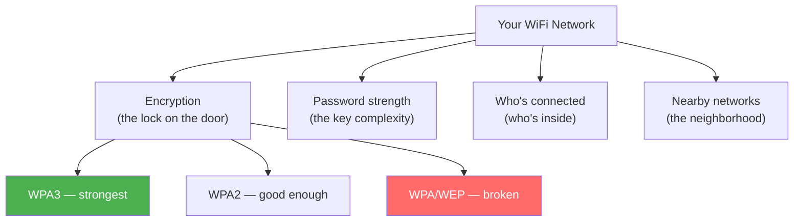
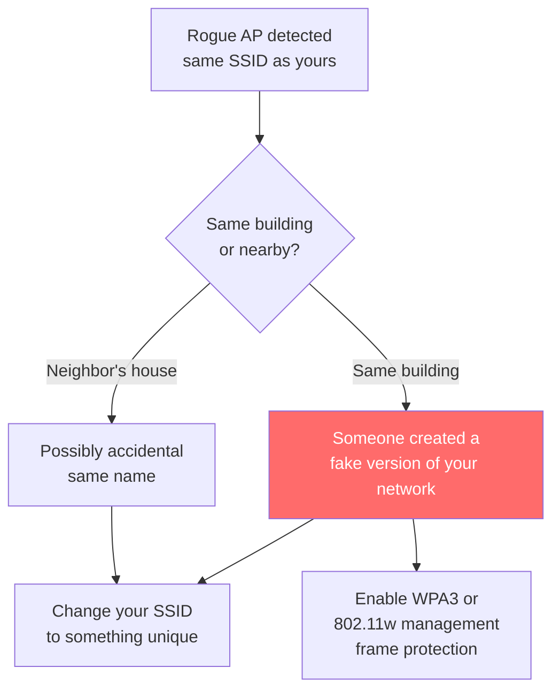

# Is My Wi-Fi Secure?

> Your WiFi network is the front door to your digital home. If it's not locked properly, anyone within range can walk in — read your traffic, use your internet, or worse. This guide helps you check the locks and find any open windows.

<!-- TODO: Hero image — generate with prompt: "Top-down illustration of a house with WiFi signal waves emanating from a router, showing a protective dome/shield over the house, with a shadowy figure outside trying to intercept signals, clean minimal style" -->

## What makes WiFi (in)secure

Your WiFi has several layers of protection. Think of it like a house:



## Step 1: Scan your WiFi environment

See what's happening in the airspace around you:

```bash
netglance wifi
```

```
WiFi Environment
──────────────────────────────────────────────────
Your network:    MyHomeWiFi
Signal:          -52 dBm (good)
Security:        WPA2-PSK
Channel:         6 (2.4 GHz)
Channel load:    high — 4 other networks on this channel

Nearby networks:
  SSID                Signal    Security    Channel
  ──────────────────────────────────────────────────
  MyHomeWiFi          -52 dBm   WPA2        6
  Neighbors_5G        -65 dBm   WPA3        36
  FreeWiFi            -70 dBm   OPEN        6
  NETGEAR-Guest       -78 dBm   WPA2        11
  HiddenNetwork       -82 dBm   WPA2        1
```

**What to check immediately:**

1. **Your security type** — should be WPA2 or WPA3. If it says WEP or WPA (without the "2"), your encryption can be cracked in minutes.
2. **Open networks nearby** — "FreeWiFi" with no security could be a trap (evil twin). Never auto-connect to open networks.
3. **Signal strength** — if your signal is weak (-70 or worse), you're more vulnerable because your device has to "shout" louder.

## Step 2: Check your encryption

The encryption type is the most important security factor:

| Encryption | Status | What to do |
|-----------|--------|-----------|
| **WPA3** | Best available | You're set. Modern and strong. |
| **WPA2-PSK (AES)** | Good | Secure for home use with a strong password. |
| **WPA2-PSK (TKIP)** | Outdated | Switch to AES in router settings. |
| **WPA** | Weak | Upgrade immediately. |
| **WEP** | Broken | Can be cracked in under 5 minutes. Change now. |
| **Open** | No encryption | Anyone can read your traffic. |

!!! warning "WEP and WPA are not secure"
    If your network uses WEP or WPA (not WPA2), treat it as if you have no encryption. Your traffic can be captured and read by anyone within WiFi range. Log into your router and switch to WPA2 or WPA3 immediately.

## Step 3: Look for rogue access points

An "evil twin" is a fake WiFi network that mimics yours. When your devices connect to it instead of the real network, the attacker can see all your traffic:

```bash
netglance wifi --rogue-detect
```

```
Rogue AP Detection
──────────────────────────────────────────────────
Your SSID:       MyHomeWiFi
Expected BSSID:  aa:bb:cc:dd:ee:ff

Results:
  ✓ MyHomeWiFi (aa:bb:cc:dd:ee:ff) — your real AP
  ✗ MyHomeWiFi (11:22:33:44:55:66) — UNKNOWN AP with same name!
```

**If a rogue AP is detected with your network name:**



## Step 4: Check channel congestion

If many networks share the same channel, everyone's performance suffers and your signal is easier to intercept in the noise:

```bash
netglance wifi --channels
```

```
Channel Usage (2.4 GHz)
──────────────────────────────────────────────────
Ch 1:  ██░░░░░░░░  2 networks
Ch 6:  ████████░░  5 networks  ← you are here
Ch 11: ███░░░░░░░  3 networks

Recommendation: Switch to channel 1 or 11
```

**For 2.4 GHz**, only channels 1, 6, and 11 don't overlap. Pick the least crowded one.

**For 5 GHz**, there are many more channels and usually less congestion. If your router supports it, use 5 GHz for devices that are close enough.

## Step 5: Audit connected devices

Check if anyone unauthorized is using your WiFi:

```bash
sudo netglance discover
```

Go through the list. If you see devices you don't recognize, follow the steps in [What's on My Network?](whats-on-my-network.md) to investigate.

**Signs of unauthorized access:**

- Unknown device vendors (especially "Unknown" or unexpected brands)
- Devices connecting at odd hours
- More devices than you own
- Unusual bandwidth usage from a specific device

## Step 6: Check for DHCP attacks

A rogue DHCP server can hand out bad network settings, redirecting your traffic through an attacker's machine:

```bash
sudo netglance dhcp
```

```
DHCP Audit
──────────────────────────────────────────────────
DHCP servers found:  1
  192.168.1.1 (aa:bb:cc:dd:ee:ff) — Netgear  ✓ expected

Rogue DHCP:          none detected
```

If more than one DHCP server is found, and the second one isn't something you set up (like a Pi-hole), it could be an attacker.

## Your WiFi security checklist

Run through these and check them off:

- [ ] **Encryption is WPA2 or WPA3** — not WEP or WPA
- [ ] **WiFi password is strong** — at least 12 characters, not a dictionary word
- [ ] **Router admin password changed** — not the default (admin/admin)
- [ ] **Router firmware is up to date** — check manufacturer's website
- [ ] **WPS is disabled** — WiFi Protected Setup has known vulnerabilities
- [ ] **Guest network is separate** — IoT devices and visitors on a different network
- [ ] **No unknown devices connected** — run `netglance discover` to check
- [ ] **No rogue access points** — run `netglance wifi --rogue-detect`
- [ ] **On the least congested channel** — run `netglance wifi --channels`

## Quick reference

| What you want to check | Command |
|------------------------|---------|
| WiFi security and signal | `netglance wifi` |
| Rogue access points | `netglance wifi --rogue-detect` |
| Channel congestion | `netglance wifi --channels` |
| Connected devices | `sudo netglance discover` |
| Rogue DHCP servers | `sudo netglance dhcp` |
| Firewall effectiveness | `netglance firewall` |

## Next steps

- [Am I Being Watched?](am-i-being-watched.md) — go deeper with DNS, ARP, and TLS checks to verify your traffic isn't being intercepted
- [Keep My Network Healthy](keep-my-network-healthy.md) — set up monitoring that alerts you when new devices appear or security changes
