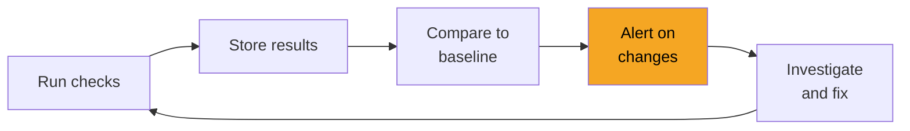
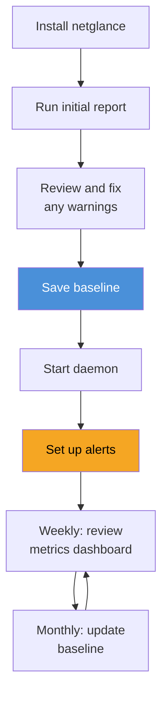

# Keep My Network Healthy

> Checking your network once is good. Keeping an eye on it continuously is better. This guide shows you how to set up netglance as an always-on guardian that watches your network and tells you when something changes — a new device appears, your speed drops, or a security check fails.

<!-- TODO: Hero image — generate with prompt: "Illustration of a calm dashboard showing green health indicators for a home network, with a small alert bell icon glowing orange for one metric, clean data visualization style, dark theme" -->

## Why continuous monitoring matters

Networks change constantly. Devices come and go. ISP performance fluctuates. That smart camera you set up last year might have a new vulnerability. Without monitoring, you'd never know until something breaks.



Here's what continuous monitoring catches:

- **New device on your network** — someone connected, or a device you forgot about woke up
- **Speed degradation over time** — your ISP is giving you less than you pay for
- **Security changes** — a device changed its open ports, DNS started leaking, WiFi encryption downgraded
- **Outages and patterns** — your internet drops every Tuesday at 3 PM (ISP maintenance?)

## Step 1: Run a full health report

Start by understanding your network's current state:

```bash
netglance report
```

```
Network Health Report
─────────────────────────────────────────────────────────
Discover     ✓ 8 devices found
DNS          ✓ No leaks, DNSSEC enabled
Ping         ✓ Gateway 3ms, Google 15ms
Speed        ⚠ Download 45 Mbps (plan: 100 Mbps)
WiFi         ✓ WPA2, signal -52 dBm, channel clear
TLS          ✓ All certificates valid
ARP          ✓ No spoofing detected
HTTP         ✓ No proxy detected
Firewall     ✓ Inbound filtered

Overall:     GOOD (1 warning)
```

The report runs every module and gives you a summary. The warning icons tell you what needs attention — in this case, speed is lower than expected.

## Step 2: Save a baseline

A baseline is a snapshot of "normal" for your network. It's what you compare future scans against:

```bash
netglance baseline save
```

```
Baseline saved
──────────────────────────────────────────────────
Devices:     8 devices recorded
Timestamp:   2025-03-15 10:30:00
Location:    ~/.config/netglance/netglance.db
```

!!! tip "Save your baseline when things are good"
    Run your baseline after you've reviewed your network and confirmed everything is as expected. Don't baseline a compromised network — you'd be comparing against a bad state.

## Step 3: Set up the daemon

The daemon runs checks automatically on a schedule, storing results in the database:

```bash
# Install and start the daemon
netglance daemon install
netglance daemon start
```

```
Daemon Status
──────────────────────────────────────────────────
Status:      running
Schedule:    every 30 minutes
Next run:    10:30:00
Last run:    10:00:00 (all checks passed)
Results:     stored in ~/.config/netglance/netglance.db
```

**What the daemon checks by default:**

| Check | Frequency | What it catches |
|-------|-----------|----------------|
| Device discovery | Every 30 min | New/missing devices |
| Ping (latency) | Every 5 min | Connection drops, latency spikes |
| DNS health | Every 30 min | DNS leaks, hijacking |
| Speed test | Every 6 hours | Speed degradation |
| ARP monitor | Every 5 min | Spoofing attacks |
| TLS verification | Daily | Certificate changes |

You can customize the schedule in `~/.config/netglance/config.yaml`.

## Step 4: Set up alerts

Tell netglance what conditions should trigger a notification:

```bash
# Alert when a new device appears
netglance alert add --metric devices --condition "new_device"

# Alert when speed drops below threshold
netglance alert add --metric speed --condition "download < 25"

# Alert when latency spikes
netglance alert add --metric ping --condition "avg > 100"

# Alert on any security finding
netglance alert add --metric security --condition "any_warning"
```

```
Active Alerts
──────────────────────────────────────────────────
1. New device detected        → notify
2. Download speed < 25 Mbps   → notify
3. Ping latency > 100 ms      → notify
4. Security warning            → notify
```

## Step 5: Review metrics over time

After the daemon has been running for a while, you can query historical data:

```bash
# See speed trends over the past week
netglance metrics speed --period 7d

# Check latency over the past 24 hours
netglance metrics ping --period 24h

# View device count over time
netglance metrics devices --period 30d
```

```
Download Speed — Last 7 Days
──────────────────────────────────────────────────
100 ┤
 80 ┤          ╭──╮
 60 ┤    ╭─────╯  ╰──╮        ╭──────
 40 ┤────╯            ╰────────╯
 20 ┤
  0 ┤
    Mon  Tue  Wed  Thu  Fri  Sat  Sun

Average: 62 Mbps  |  Min: 38 Mbps  |  Max: 95 Mbps
```

**Patterns to look for:**

- **Consistent drops at same time** — ISP congestion (usually evenings)
- **Gradual decline over weeks** — ISP throttling or equipment degradation
- **Sudden permanent drop** — ISP plan change, or equipment failure
- **Spikes in device count** — unauthorized access or a smart home device misbehaving

## Step 6: Check for changes

Compare current state against your saved baseline:

```bash
netglance baseline diff
```

```
Changes since baseline (saved 7 days ago)
──────────────────────────────────────────────────
Devices:
  + NEW:  192.168.1.30 (Espressif) — smart plug?
  - GONE: 192.168.1.15 (Apple) — iPad went offline

Network:
  ~ Speed: was 95 Mbps, now 62 Mbps (35% decrease)
  ~ WiFi channel: was 6, now 11 (auto-switched)

Security:
  ✓ No new security concerns
```

## Recommended monitoring setup

Here's what I recommend for most home networks:



**Daily** (automatic via daemon):

- Latency and connectivity checks every 5 minutes
- Device discovery every 30 minutes
- ARP monitoring every 5 minutes

**Weekly** (manual, takes 2 minutes):

- Review `netglance metrics` for trends
- Check `netglance baseline diff` for changes
- Glance at any triggered alerts

**Monthly** (manual, takes 5 minutes):

- Run a full `netglance report`
- Update your baseline if changes are expected
- Review your alert thresholds

## Deployment options

Want netglance running 24/7 without keeping a terminal open? Several options:

| Platform | Best for | Guide |
|----------|----------|-------|
| **macOS launchd** | Mac Mini or MacBook that's always on | [macOS Daemon](../../reference/deployment/mac-mini-daemon.md) |
| **Raspberry Pi** | Dedicated, low-power monitoring device | [Raspberry Pi](../../reference/deployment/raspberry-pi.md) |
| **Docker** | NAS, server, or any machine with Docker | [Docker](../../reference/deployment/docker.md) |
| **Cron/systemd** | Linux machines with minimal setup | [Scheduling](../../reference/deployment/scheduling.md) |

A Raspberry Pi is the most popular choice — it's cheap, silent, low-power, and can monitor your network around the clock.

## Quick reference

| What you want to do | Command |
|---------------------|---------|
| Run full health check | `netglance report` |
| Save current state | `netglance baseline save` |
| Check for changes | `netglance baseline diff` |
| Start background monitoring | `netglance daemon start` |
| Add an alert rule | `netglance alert add --metric ... --condition ...` |
| View historical metrics | `netglance metrics <type> --period <time>` |
| Check daemon status | `netglance daemon status` |

## Next steps

- [What's on My Network?](whats-on-my-network.md) — do a thorough initial audit before setting your baseline
- [Is My Internet Actually Slow?](is-my-internet-slow.md) — diagnose speed and latency issues before setting alert thresholds
- [Raspberry Pi deployment](../../reference/deployment/raspberry-pi.md) — set up a dedicated monitoring device for under $50
