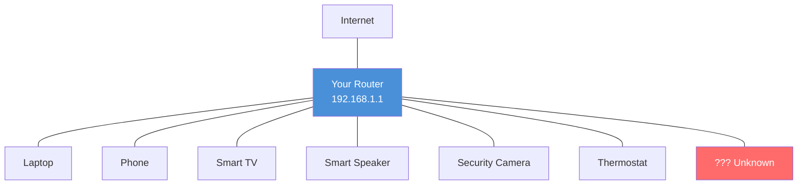
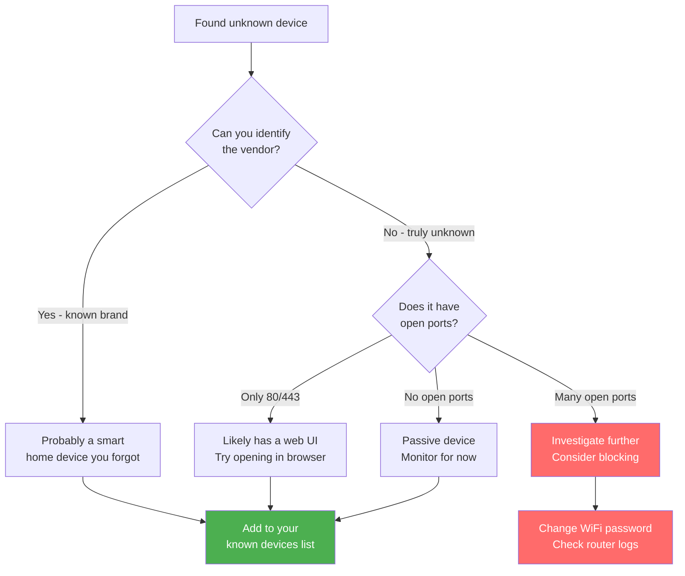

# What's on My Network?

> You'd be surprised how many devices are connected to your home network. Smart speakers, security cameras, that old tablet you forgot about, your kid's gaming console — they're all talking to the internet. This guide helps you find every single one.

<!-- TODO: Hero image — generate with prompt: "Isometric illustration of a home with glowing connection lines from various devices (laptop, phone, smart speaker, security camera, thermostat, TV) all connecting to a central router, clean minimal style, blue and white color scheme" -->

## Why this matters

Every device on your network is a potential entry point. An unpatched smart camera could be accessed from the internet. An old phone you no longer update might have known vulnerabilities. You can't secure what you don't know about.

Beyond security, knowing your devices helps you:

- **Troubleshoot slowdowns** — find the device hogging bandwidth
- **Catch freeloaders** — spot unauthorized devices using your WiFi
- **Plan upgrades** — understand how many devices your router handles

## How your home network looks

Here's what a typical home network looks like — your router sits in the middle, connecting everything:



That red "Unknown" device? That's what we're going to find.

## Step 1: Discover your devices

Run a network scan to find everything that's connected:

```bash
sudo netglance discover
```

You'll see a table like this:

```
IP Address       Hostname         MAC Address        Vendor
───────────────────────────────────────────────────────────────
192.168.1.1      router.local     aa:bb:cc:dd:ee:ff  Netgear
192.168.1.10     macbook.local    11:22:33:44:55:66  Apple
192.168.1.15     -                77:88:99:aa:bb:cc  Amazon
192.168.1.20     -                dd:ee:ff:00:11:22  Unknown
192.168.1.25     living-room-tv   33:44:55:66:77:88  Samsung
```

**What the columns mean:**

- **IP Address** — the device's address on your local network (like a room number in a building)
- **Hostname** — the device's name, if it announces one (many don't)
- **MAC Address** — a unique hardware ID burned into every network device
- **Vendor** — the manufacturer, looked up from the MAC address prefix

!!! tip "Why do I need `sudo`?"
    Network scanning sends special low-level packets (ARP requests) that require administrator privileges. It's like knocking on every door in a building — you need permission to do that.

## Step 2: Identify unknown devices

Got devices you don't recognize? Dig deeper:

```bash
sudo netglance identify 192.168.1.20
```

This tries to figure out what the device actually is — not just who made it, but what type of device it is (phone, camera, printer, etc.) and what operating system it runs.

**Common "mystery" devices and what they usually are:**

| Vendor | Usually is... |
|--------|--------------|
| Amazon | Echo/Alexa speaker, Fire TV, Ring doorbell |
| Google | Nest speaker, Chromecast, Nest camera |
| Espressif | Smart home device (smart plug, light bulb, sensor) |
| Raspberry Pi | DIY project, Pi-hole, home server |
| Unknown | Could be anything — investigate further |

## Step 3: Check what suspicious devices are doing

If you find a device you truly don't recognize, check what services it's running:

```bash
sudo netglance scan 192.168.1.20
```

This scans for open ports — network "doors" that the device is listening on:

```
Port     Service      State    Info
─────────────────────────────────────────
22       SSH          open     OpenSSH 8.9
80       HTTP         open     nginx web server
443      HTTPS        open     nginx
8080     HTTP-Alt     open     Unknown
```

**What to look for:**

- **Port 80/443 (HTTP/HTTPS)** — the device has a web interface. Try opening `http://192.168.1.20` in your browser.
- **Port 22 (SSH)** — the device accepts remote terminal connections. Normal for computers and Raspberry Pis, suspicious on a "smart lightbulb."
- **Port 554 (RTSP)** — video streaming. This is a camera.
- **Unusual high ports** — could be anything. Worth investigating if the device is unknown.

## Step 4: Save your inventory

Once you know what everything is, export the list so you have a record:

```bash
# Save as a spreadsheet-friendly CSV
netglance export --format csv --output my-devices.csv

# Save as a shareable HTML page
netglance export --format html --output my-devices.html
```

Open the HTML file in a browser for a nicely formatted device inventory you can share or print.

## Step 5: Set a baseline

Now that you know what's on your network, save a snapshot. netglance will alert you when something new appears:

```bash
# Save current state
netglance baseline save

# Later, check for changes
netglance baseline diff
```

```
Baseline comparison (saved 2 days ago)
──────────────────────────────────────────────────
+ NEW:  192.168.1.30  (Unknown vendor)        ← new device appeared
- GONE: 192.168.1.15  (Amazon)                ← device left
~ CHANGED: 192.168.1.20 hostname changed      ← something changed
```

The `+` lines are new devices that weren't there before — exactly what you want to know about.

## What if I find something I don't recognize?

Don't panic. Here's a decision tree:



**If you find a truly suspicious device:**

1. **Check your router's admin page** — most routers show connected devices with more detail
2. **Change your WiFi password** — this kicks everything off; reconnect only the devices you recognize
3. **Run `netglance baseline diff`** — after changing the password, anything that reconnects without you entering the new password is using a wired connection (or has the new password somehow)

## Quick reference

| What you want to do | Command |
|---------------------|---------|
| Find all devices | `sudo netglance discover` |
| Identify a device | `sudo netglance identify <ip>` |
| Scan a device's ports | `sudo netglance scan <ip>` |
| Export device list | `netglance export --format csv` |
| Save a baseline | `netglance baseline save` |
| Check for new devices | `netglance baseline diff` |

## Next steps

- [Is My Wi-Fi Secure?](is-my-wifi-secure.md) — check your wireless network's encryption and find rogue access points
- [Am I Being Watched?](am-i-being-watched.md) — check if anyone is intercepting your network traffic
- [Keep My Network Healthy](keep-my-network-healthy.md) — set up continuous monitoring so you know the moment something changes
